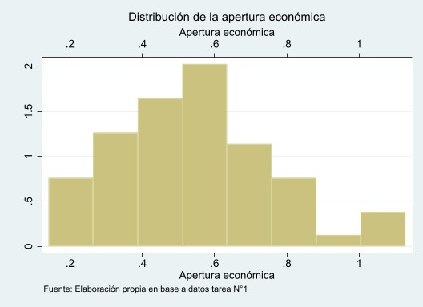
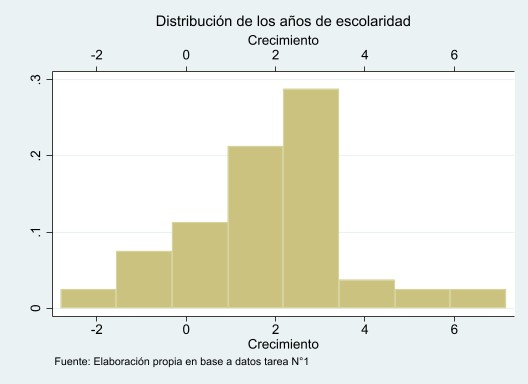
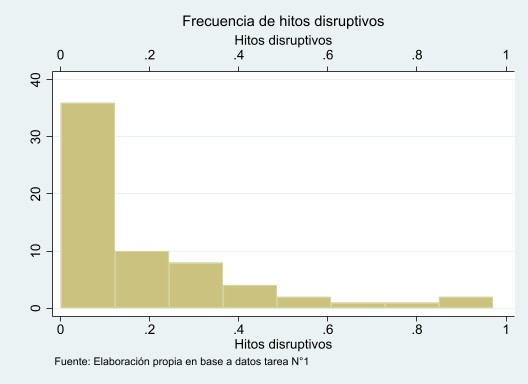
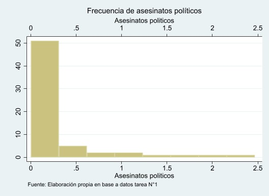
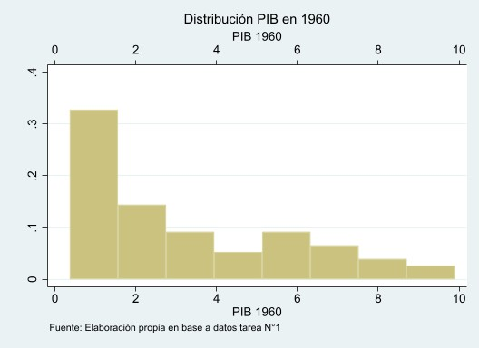

```{r setup, include=FALSE}
knitr::opts_chunk$set(warning = FALSE,
                      error = F, 
                      message = FALSE,
                      echo = FALSE, fig.pos = "H", out.extra = "") 
Sys.setlocale("LC_ALL","ES_ES.UTF-8") # para temas de caracteres en español, recomendable
summarytools::st_options(
  plain.ascii = FALSE, 
  style = "rmarkdown",
  dfSummary.style = "grid",
  dfSummary.valid.col = FALSE,
  dfSummary.graph.magnif = 1.5,
  subtitle.emphasis = FALSE,
  tmp.img.dir = "/tmp",
  lang = "es"
)
table.expand <- function(cells, cols.width, justify, sep.cols) {
        cells <- enc2native(cells)
        .Call('pander_tableExpand_cpp', PACKAGE = 'pander', cells, cols.width, justify, sep.cols, style)
        .Call('pander_tableExpand_cpp', PACKAGE = 'pander', cells, cols.width, justify, sep.cols, style)
}


plot_residuals <- function(fit, geom.size = 2, remove.estimates = NULL, show.lines = TRUE,
                      show.resid = TRUE, show.pred = TRUE, show.ci = FALSE) {
  # show lines only when both residual and predicted
  # values are plotted - else, lines make no sense
  if (!show.pred || !show.resid) show.lines <- FALSE

  # Obtain predicted and residual values
  mydat <- insight::get_data(fit)

  # check whether estimates should be removed from plot
  if (!is.null(remove.estimates)) {
    keep <- which(!colnames(mydat) %in% remove.estimates)
  } else {
    keep <- seq_len(ncol(mydat))
  }
  mydat$predicted <- stats::predict(fit)
  mydat$residuals <- stats::residuals(fit)

  # get name of response, used in ggplot-aes
  rv <- insight::find_response(fit)

  # remove estimates, if required
  dummy <- mydat %>% dplyr::select(keep, .data$predicted, .data$residuals)

  # set default variable labels, used as column names, so labelled
  # data variable labels appear in facet grid header.
  sel <- 2:length(keep)
  var.labels <- sjlabelled::get_label(dummy, def.value = colnames(dummy)[sel])[sel]
  if (is.null(var.labels) || all(var.labels == "")) var.labels <- colnames(dummy)[sel]
  colnames(dummy)[sel] <- var.labels

  # melt data
  mydat <- suppressWarnings(dummy %>%
    tidyr::gather(key = "grp", value = "x", -1, -.data$predicted, -.data$residuals))

  colnames(mydat)[1] <- ".response"

  # melt data, build basic plot
  res.plot <- ggplot(mydat, aes(x = .data$x, y = .data$.response)) +
    stat_smooth(method = "lm", se = show.ci, colour = "grey70")

  if (show.lines) res.plot <- res.plot +
    geom_segment(aes(xend = .data$x, yend = .data$predicted), alpha = .3)

  if (show.resid) res.plot <- res.plot +
    geom_point(aes(fill = .data$residuals), size = geom.size, shape = 21, colour = "grey50")

  if (show.pred) res.plot <- res.plot +
    geom_point(aes(y = .data$predicted), shape = 1, size = geom.size)

  # residual plot
  res.plot <- res.plot +
    facet_grid(~grp, scales = "free", space = "free") +
    scale_fill_gradient2(low = "#1a476f", mid = "white", high = "#c10534") +
    guides(color = FALSE, fill = FALSE) +
    labs(x = NULL, y = sjlabelled::get_label(mydat[[1]], def.value = rv))

  res.plot
}

```

```{r load pack, echo = F}
# 1. Cargar paquetes ------------------------------------------------------
pacman::p_load(googledrive, easystats, tidyverse, ggthemes,
               sjPlot, sjmisc, summarytools,
               texreg, ggpubr, multcomp, jtools)
theme_set(theme_stata(base_size = 10, base_family = "sans", scheme = "s2color"))
sjPlot::set_theme(theme_stata(base_size = 10, base_family = "sans", scheme = "s2color"))
options(knitr.table.format = "latex")
kable <- function(data) {
  kableExtra::kable(data, booktabs = TRUE, digits = 3) %>% 
    kableExtra::kable_styling(latex_options =c("scale_down"), position = "center")
}
# 2. Load data ------------------------------------------------------------
#drive_download("https://drive.google.com/file/d/1mXM-tODPoPS_-QbVM4F9x7QV07rNkyGf/view?usp=sharing", path = "input/base_tarea1.dta")
data <- haven::read_dta("../input/base_tarea1.dta")
data2 <- haven::read_dta("../input/base_tarea1.dta")
data <- sjlabelled::set_label(data, c("País", "Tasa crecimiento anual PIB real",
                                      "Grado de apertura comercio", "Escolaridad adultos(años promedio)",
                              "Hitos disruptivos(promedio anual)","Asesinatos políticos(promedio anual)",
                              "PIB per cápita (base 1960)"))
corr <- readxl::read_xlsx("input/correlation-doc.xlsx")
options(knitr.kable.NA = '')

```

\thispagestyle{empty} 


\newpage

# Análisis descriptivo

## 1. Distribuciones univariadas


+----------------+--------------------------+-------------------------+----------------------+
| Variable       | Estadísticas / Valores   | Frec. (% sobre válidos) | Gráfico              |
+================+==========================+=========================+======================+
| growth\        | Media (d-s) : 1.9 (1.8)\ | 64 valores distintos    |  |
|                | min < mediana < max:\    |                         |                      |
|                | -2.8 < 2 < 7.2\          |                         |                      |
+----------------+--------------------------+-------------------------+----------------------+
| tradeshare\    | Media (d-s) : 0.5 (0.2)\ | 64 valores distintos    |  |
|                | min < mediana < max:\    |                         |                      |
|                | 0.1 < 0.5 < 1.1\         |                         |                      |
+----------------+--------------------------+-------------------------+----------------------+
| yearsschool\   | Media (d-s) : 4 (2.6)\   | 62 valores distintos    |  |
|                | min < mediana < max:\    |                         |                      |
|                | 0.2 < 3.6 < 10.1\        |                         |                      |
+----------------+--------------------------+-------------------------+----------------------+
| rev_coups\     | Media (d-s) : 0.2 (0.2)\ | 23 valores distintos    |  |
|                | min < mediana < max:\    |                         |                      |
|                | 0 < 0.1 < 1\             |                         |                      |
+----------------+--------------------------+-------------------------+----------------------+
| assasinations\ | Media (d-s) : 0.3 (0.5)\ | 26 valores distintos    |  |
|                | min < mediana < max:\    |                         |                      |
|                | 0 < 0.1 < 2.5\           |                         |                      |
+----------------+--------------------------+-------------------------+----------------------+
| rgdp60\        | Media (d-s) : 3.1 (2.5)\ | 64 valores distintos    |  |
|                | min < mediana < max:\    |                         |                      |
|                | 0.4 < 2 < 9.9\           |                         |                      |
+----------------+--------------------------+-------------------------+----------------------+

En el **Cuadro 1** podemos ver un resumen de los estadísticos descriptivos univariados de cada variable, incluido los gráficos de distribucipon. 

La variable *“growth”* hace alusión a la tasa promedio de crecimiento anual del PIB real. Se obtuvo una media de 1.9, su mínimo es -2.8, su mediana 2 y por último su máximo 7.2. También se obtuvo su coeficiente de variación, siendo un valor de 2, y su desviación estándar de 1.8. Se puede observar, a partir del gráfico, que la variable sigue una distribución normal, lo cual será significativo en el análisis.

La variable *“tradeshare”* refleja el grado de apertura económica promedio. Se concluyó una media de 0.5, su mínimo es 0.1, su mediana, al igual que su media, de 0.5 y por último su máximo 1.1. Su coeficiente de variación es 0.3 y su desviación estándar es 0.2. Del gráfico se puede asociar a la variable con una distribución chi cuadrado a partir de su forma.

La variable *“yearsschool”* son los años de escolaridad promedio de la población adulta en 1960. A partir de la tabla, vemos una media de 4, un mínimo de 0.2, su mediana de 3.6 y por último su máximo 10.1. El coeficiente de variación es de 3.5 y su desviación estándar es 2.6. Se puede observar del gráfico que la variable sigue una distribución chi cuadrado, debido a su forma.

La variable *“rev_coups”* hace alusión a :insurrecciones y golpes de estado entre 1960 y 1995.  Se obtuvo a partir de los datos una media de 0.2, un mínimo de 0, una mediana de 0.1 y por último un máximo de 1. El coeficiente de variación es de 0.3 y su desviación estándar, al igual que su media, es 0.2. Se puede obtener a partir del gráfico que sus valores se concentran en el 0 y se asemeja a una distribución Fisher,  lo que nos puede traer consecuencias en el análisis de regresión.

La variable *“assasinations”* refleja el promedio anual de asesinatos políticos entre 1960 y 1995. Se concluyó una media de 0.3, un mínimo de 0, una mediana de 0.1 y por último un máximo de 2.5. El coeficiente de variación es de 0.2 y su desviación estándar es de 0.5. A partir del gráfico se puede observar que, al igual que la variable “rev_coups”, sus valores están concentrados en el 0.

La variable *“rgdp60”* hace referencia al PIB per cápita en 1960. Se obtuvo una media de 3.1, un mínimo de 0.4, su mediana de 2 y por último su máximo 9.9. El coeficiente de variación es de 4 y su desviación estándar de 2.5. Refiriéndonos al gráfico, podemos observar que la variable tiene una distribución donde los valores son considerablemente dispersos.


\pagebreak

## 2. Distribuciones bivariadas

### Matriz de correlaciones de todas las variables 

En el **Cuadro 2** presentamos la matriz de correlaciones entre las variables que describimos anteriormente. El análisis entre los pares de relaciones se enfocará en aquellas que son estadísticamente significativas, junto con profundizar en su dirección e intensidad (Cohen, 1988). Es importante recordar que el método en que se estima la asociación es el de Pearson, es decir, evalúa la relación lineal entre pares de variables. 

```{r corr }
corr %>%
  kableExtra::kable(., booktabs = T, caption = "Matriz de correlaciones (R Pearson)") %>% kableExtra::footnote(general_title = "Nota: ",general = "*** p < 0,01; ** p < 0,05; * p < 0,1.") %>% 
    kableExtra::kable_styling(latex_options =c("HOLD_position","scale_down"), position = "center")
```

En primer lugar, los resultados de la correlación entre *“tradeshare” y “growth”* muestran una relación significativa, positiva y débil (*r = 0.211,  p  < 0.1*). Con un 90% de confianza podemos decir que un mayor grado de apertura económica promedio está asociado a una mayor será la tasa promedio de crecimiento anual del PIB real.

Los resultados de la correlación entre la variable *“yearsschool” y “growth”* presentan una relación significativa, positiva y de magnitud media (*r = 0.323, p < 0.01*). Con un nivel de confianza de un 99%, podemos afirmar que una mayor cantidad de años de escolaridad promedio de la población adulta en 1960, se asocia a una mayor tasa promedio de crecimiento anual del PIB real. 

Luego, los resultados de la correlación entre la variable *“rev_coups” y “growth”* muestran una relación significativa, de magnitud media y negativa  (*r = - 0.271, p < 0.05*). Lo que significa que, con un 95% de confianza, podemos decir que a una mayor cantidad de insurrecciones y golpes de estado entre 1960 y 1995, se asocia una tasa promedio de crecimiento anual del PIB real menor. 

Los resultados de la correlación entre la variable *“rev_coups” y “tradeshare”* muestran una relación débil, negativa y significativa (*r = - 0.206, p < 0.1*). Lo que significa que mientras mayor sea la cantidad de insurrecciones y golpes de estado entre 1960 y 1995, se asocia a menor grado de apertura económica promedio, con 90% de confianza. 

Los resultados de la correlación entre la variable *“assasinations” y “tradeshare”* presentan una relación significativa, de magnitud media y negativa. (*r = - 0.348, p < 0.01*). Lo que significa que, con 99% de confianza, se puede afirmar que mientras mayor sea el promedio anual de asesinatos políticos entre 1960 y 1995, menor será el grado de apertura económica promedio. 

Podemos apreciar que los resultados de correlación entre *“rev_coups” y “yearsschool”* presentan una relación significativa, negativa y de magnitud media (*r = -0.329, p < 0.01*). Esto significa que, con 99% de confianza, se puede afirmar que frente a un mayor número de insurrecciones y golpes de estado que hayan habido entre 1960 y 1995, menor serán los años de escolaridad promedio de la población adulta en 1960. 


De los resultados de la correlación entre la variable *“rgdp60” y “yearsschool”* se obtuvo una relación significativa, de alta magnitud y  positiva (*r = 0.834, p < 0.01*). Esto significa que podemos afirmar que mientras mayor el  PIB per cápita en 1960, mayor serán los años de escolaridad promedio de la población adulta en 1960, con un 99% de confianza. 

Los resultados de correlación entre *“assasinations” y “rev_coups”* presentan una relación significativa, positiva y de magnitud media (*r =0.487, p < 0.01*). Esto significa que, con un 99% de confianza, se puede asociar un mayor promedio anual de asesinatos políticos entre 1960 y 1995, con un mayor número de insurrecciones y golpes de estado ocurridos entre 1960 y 1995.  

Por último, podemos apreciar que los resultados de correlación entre *“rgdp60” y “rev_coups”* entregaron una relación significativa, fue de magnitud media y negativa (*r = -0.389, p < 0.01*). Esto significa que se puede asociar un mayor PIB per cápita en 1960, con un menor número de insurrecciones y golpes de estado que hubo entre 1960 y 1995, con un 99% de confianza.


## 3. Gráficos de dispersión

Gráficamente podemos representar el par de relaciones antes indicadas en un diagrama de dispersión que refleja no solo la dirección y la fuerza de relación, sino que también la forma en que estas variables se relacionan entre sí.

```{r corrploti, fig.cap= "Gráfico de dispersión entre la tasa de crecimiento económico y el grado de apertura de comercio.", fig.pos = 'H'}
ggscatter(data, x = "tradeshare", y = "growth",
   add = "reg.line",
   add.params = list(color = "gray", fill = "lightgray"), 
   conf.int = TRUE, 
   cor.coef = TRUE, 
   cor.coeff.args = list(method = "pearson", label.sep = "\n")
   ) + labs(x = "Grado de apertura de comercio (promedio, en PIB)", y = "Tasa crecimiento anual (PIB real)", title = "", caption = "Fuente: Elaboración propia en base a datos Tarea N°1") + theme_stata(base_size = 10, base_family = "sans", scheme = "s2color")
```

La *Figura 1* muestra que es difícil afirmar de manera certera que exista una relación lineal, positiva y significativa entre el grado de apertura al comercio y la tasa de crecimiento anual, es decir, cuando aumenta el grado de apertura al comercio, aumenta la tasa anual de crecimiento del PIB.  Un elemento importante que aporta la *Figura 1* es que existe una gran dispersión de los datos, dado que no se sigue un patrón claro relacionado a la línea que marcamos como tendencia lineal. Esta información visual se apoya de los estadísticos reportados: la relación positiva observada es de débil intensidad (r cercano a 0).  De manera sustantiva, veremos que estos resultados son esperables en términos económicos.  Veremos que  la dispersión del grado de apertura económica más que asociada al crecimiento económico, es probable que esté asociada a otras variables de la *performance económica* (*Cuadro 3*). De hecho, tal como veremos en el efecto marginal de esta variable sobre el crecimiento económico (*Figura 5*), el error estimado asociado a esta predicción generará que se pierda significancia estadística de esta variable. 


```{r corrplot2, fig.cap= "Gráfico de dispersión entre la tasa de crecimiento económico y los años de educación de adultos", fig.pos='H'}
ggscatter(data, x = "yearsschool", y = "growth",
   add = "reg.line",
   add.params = list(color = "gray", fill = "lightgray"), 
   conf.int = TRUE, 
   cor.coef = TRUE, 
   cor.coeff.args = list(method = "pearson", label.sep = "\n")
   )  + labs(x = "Escolaridad adultos (años promedio)", y = "Tasa crecimiento anual (PIB real)", caption = "Fuente: Elaboración propia en base a datos Tarea N°1") + theme_stata(base_size = 10, base_family = "sans", scheme = "s2color")
```
Por el contrario, en la *Figura 2* podemos observar una relación un poco más clara entre los años de educación promedio del país y la tasa de crecimiento anual. Ahora bien, tal como podemos evidenciar en los estadísticos reportados en la figura y el *Cuadro 2*, esta asociación es débil, lo que gráficamente se ve en que si bien el patrón de aumento de los años de escolaridad implica una mayor tasa de crecimiento, esta asociación no es tan marcada (línea negra aplanada). A diferencia de lo que veremos en el efecto marginal predichos de los años de escolaridad promedio y la tasa de crecimiento, la relación esperada es más notoria que la de los datos observados (*Figura 6*). En términos sustantivos, tal como discutiremos en el punto 4, si bien la educación ha sido relevada como una variable “residual” en los modelos de crecimiento económico neoclásico, este parámetro mostrará ser importante en la predicción de la tasa de crecimiento económico anual del PIB real. 


\pagebreak 

# Análisis de regresión

## 4. Análisis de regresión lineal múltiple

```{r est-model}
model1 <- lm(growth ~ tradeshare + yearsschool + rev_coups + assasinations + rgdp60, data = data)

```

```{r comprobation-model}
modeldata <- broom::augment(model1)
rsq <- round(summary(model1)$r.squared,4)
inter <- round(coef(model1)[1],3)[[1]]
coef.trade <- round(coef(model1)[2],3)
coef.sch <- round(coef(model1)[3],3)
coef.rev <- round(coef(model1)[4],3)
coef.assa <- round(coef(model1)[5],3)
coef.rgd <- round(coef(model1)[6],3)

p.trade <- summary(model1)$coefficients[2,4]
p.sch <- summary(model1)$coefficients[3,4]
p.rev <- summary(model1)$coefficients[4,4]
p.assa <- summary(model1)$coefficients[5,4]
p.rgd<- summary(model1)$coefficients[6,4]

t.trade <- round(summary(model1)$coefficients[2,3],2)
t.sch <- round(summary(model1)$coefficients[3,3],2)
t.rev <- round(summary(model1)$coefficients[4,3],2)
t.assa <- round(summary(model1)$coefficients[5,3],2)
t.rgd <- round(summary(model1)$coefficients[6,3],2)
m.df <- model1$df.residual

```

En términos formales tenemos las dos siguientes rectas de regresión, donde *(1)* indica la función de regresión poblacional que se busca estimar y *(2) con continuación en (3)* la función de regresión lineal estimada con Método de Mínimos Cuadrados Ordinarios.

**Función de Regresión Lineal Poblacional**


\begin{align}
\widehat{\text{growth}} = \beta_0 + (\beta_1 \cdot X_{\text{tradeshare}}) + (\beta_2 \cdot X_{\text{yearsschol}}) + (\beta_3 \cdot X_{\text{revcoups}}) + (\beta_4 \cdot X_{\text{assasinations}}) + (\beta_5 \cdot X_{\text{rgdp60}}) + u
\end{align}


**Función de Regresión Lineal Muestral**

\begin{align}
\widehat{\text{growth}} = `r inter` + (`r coef.trade` \cdot X_{\text{tradeshare}}) + (`r coef.sch` \cdot X_{\text{yearsschol}}) + (`r coef.rev` \cdot X_{\text{revcoups}}) + \\ (`r coef.assa` \cdot X_{\text{assasinations}}) + (`r coef.rgd` \cdot X_{\text{rgdp60}}) + u
\end{align}


Los modelos de regresión lineal  múltiple que estiman la tasa de crecimiento anual (medida en PIB real) son presentados en el Cuadro 3. Se ha propuesto cinco predictores relevantes para entender el cambio en la tasa de crecimiento del PIB real, los cuales hemos agrupado en determinantes económicos (grado de apertura económica), determinantes sociales (escolaridad de los adultos) y políticos (hitos disruptivos y asesinatos políticos en promedio anual). Por último, se ha incorporado como control el PIB per cápita de 1960, de modo de establecer una base de comparación. 


```{r, results="asis"}
texreg::texreg(model1,
               groups = list(" " = 1, 
                                      "Determinante económico" = 2, 
                                      "Determinante social" = 3,
                                      "Determinantes políticos" = 4:5,
                                      "Control" = 6),
               custom.coef.names =  c("Intercepto",  "Grado de apertura comercio (promedio, en PIB)", "Escolaridad adultos (años promedio)",
                              "Hitos disruptivos (promedio anual)","Asesinatos políticos (promedio anual)",
                              "PIB per cápita (base 1960)"),
               custom.note = "*** \\textit{p} < 0,001; ** \\textit{p} < 0,01; * \\textit{p} < 0,05. Coeficientes de regresión no estandarizados y error estándar entre paréntesis", 
               digits = 3,
               caption = "Modelo de regresión lineal que estima la tasa de crecimiento anual (en PIB)", 
               caption.above = T,
               include.adjrs = T,
               include.fstatistic = T, 
               include.rmse = T,
               custom.model.names = "Modelo 1",
               float.pos = "H")
```


Como puede verse en el Cuadro 3, el coeficiente de grado de apertura económica es positivo pero no significativo a un 95% de confianza, controlando por las determinantes sociales y políticas del modelo. Esto quiere decir que un mayor grado de apertura económica significa un aumento en la tasa de crecimiento anual de un país, o en términos específicos, por cada unidad de aumento en el grado de apertura promedio, la tasa de crecimiento anual del PIB real aumenta *en promedio* en 1.341 puntos porcentuales. Ahora bien, esta relación no es significativa a nivel poblacional por lo que existe una probabilidad alta (p = 0.960) de que no exista un efecto del grado de apertura económica sobre la tasa de crecimiento anual de un país ($\beta_1 = 1.341$, *p* = 0.960 )


La pregunta por si menores barreras para el comercio internacional, controlando por otras características de los países, produce un mayor crecimiento económico ha sido discutida de manera extensiva. Si bien nuestros resultados pueden parecer pueden contradictorios respecto a las investigaciones más clásicas del crecimiento económico (Dollar, 1992; Sach y Warner, 1995), investigaciones recientes han argumentado que existe poca evidencia para afirmar este efecto: por un lado, existen serios problemas de medición respecto a indicadores apertura económica, donde muchas veces los niveles de apertura están altamente correlacionados con otras razones respecto a un mal desempeño económico (ie. el monopolio de exportaciones-importaciones) [(Rodriguez & Rodrik, 2000)](https://www.journals.uchicago.edu/doi/pdf/10.1086/654419) ; por otro lado, existen problemas de heterocedasticidad importante entre grupos de países que han ido convergiendo a modelos neoliberales y aquellos que no (Ben-David, 1993). Con ello se puede demostrar que existe una relevancia importante de los regímenes institucionales sobre materias de comercio internacional (Baccaro & Howell, 2011). Este último punto es importante, considerando que el tramo en que se está analizando la tasa de crecimiento (1960 a 1995) no está corregido según nivel de desarrollo del país.

A su vez, estos argumentos no solo son reforzados con evidencia empírica reciente que utiliza un indicador similar al nuestro sobre crecimiento económico [(Ulaşan, 2015)](https://www.tandfonline.com/doi/full/10.1080/13504851.2014.931914?casa_token=-HuiTKmWIC4AAAAA%3AaNjM7zmuLS4dFpvMRDEDS4W41o4iiBMXn7u3Ndw47a2hdAI69e11_eTKOX-p-8on_hmJZR-5_1wszqE), sino que también nuestros mismos datos muestran que existe una distribución heterogénea de crecimiento económico según región (América Latina, Países europeos y Asiáticos) junto con que el modelo no pasa el test de Breush-Pagan sobre heterocedasticidad (ver Apéndice). 


En esta misma línea se ha incorporado los años de escolaridad de los adultos (en años promedio), predictor que para la literatura sobre crecimiento económico ha tenido sentido como un control sociodemográfico [(Barro, 2001)](https://www.knowledge4all.com/Temp/Files/4643262a-6f77-40f1-8fe9-d3ce5bd2ef97.pdf). Ahora bien, nuestro resultado sobre el nivel de educación parece ser consistente con investigaciones más recientes que indican que realmente este sería un buen predictor del crecimiento económico por ser un indicador del aumento en el capital humano (Barro, 2010), es decir, del capital “social” que contribuye en la producción. De manera concreta, nuestros resultados muestran que por cada año que aumenta la escolaridad promedio en la población adulta, la tasa de crecimiento anual del PIB real aumenta en 0.564 puntos porcentuales, controlada por el resto de las variables del modelo. A diferencia del resultado anterior respecto a la apertura económica, sí podemos afirmar que, con un 99% de confianza, existe evidencia sustantiva que indica un efecto positivo del aumento en los años de escolaridad sobre el crecimiento económico. De manera más precisa, si los años de educación promedio aumentan en 3 años, la tasa de crecimiento anual del PIB real aumentaría en cerca de 1,7% puntos porcentuales, una cifra no menor considerando la distribución empírica de la variable en nuestra muestra (media 4 años y desviación estándar de 2.6 años).

Como comentamos anteriormente, la educación ha sido incorporada como una variable residual para entender  la variación real del PIB en la macroeconomía neoclásica (véase en modelos como el de Ramsey, 1928; cf. Solow, 1965, cf. 1999). Bajo estas perspectivas, su importancia ha sido argumentada como un factor más que promueve la productividad total de factores (PTF o residuo de Solow, para más véase Carmona (2007)), pero poco se ha profundizado y especificado su importancia  y la de otras determinantes sociodemográficos sobre el crecimiento económico (Cruz & Ahmed, 2018). 


Existen argumentos sólidos para entender estos dos primeros resultados de nuestro modelo. Pese al carácter endógeno de los modelos de crecimiento económico de los 70 y 80, dado su énfasis en el efecto de determinantes económicos sobre la performance económica (cf. Mankiw et al., 1992), han sido bastante útiles para entender por qué en economías avanzadas los países crecieron a largo plazo  a pesar de que fueron disminuyendo los retornos del stock de capital físico. Esta evidencia fue relevante como puntapié para plantear la importancia de los retornos del capital humano sobre el crecimiento económico (en Hanushek & Woessmann, 2012 ver *Figura en Apéndice B*) , predictor que sobre todo se torna importante considerando la crisis de la sociedad industrial, creciendo sectores productivos menos manuales y con requerimientos más altos de calificación. 

Respecto a las determinantes políticas como el promedio anual de hitos disruptivos (ie. dictaduras e insurrecciones) y asesinatos políticos entre 1960 a 1995, no tienen un efecto significativo a nivel poblacional (p > 0.05). De hecho, los denominados hitos disruptivos en términos sociopolíticos tienen un efecto negativo y de gran tamaño efecto, en comparación a los asesinatos políticos que tienen un tamaño de efecto bastante inferior en términos relativos. Probablemente estos indicadores fueron incorporados para entender el efecto de la estabilidad política sobre el crecimiento económico (Feng, 1997) , pero tal como se ha planteado desde modelos que buscan construir análisis causales (Heo & Tan, 2001) no solo es necesario incorporar indicadores de democracia sino que producir una mejor especificación de las variables. Este argumento lo reforzamos con la *Figura 3*, donde podemos ver que existe un gran error estándar asociado al predictor de hitos disruptivos y de asesinatos políticos (ambos pasando por el $\beta = 0$

Por último, planteamos el PIB per cápita de 1960 como un control estadístico para entender el cambio en la tasa de crecimiento, de modo de parcializar el efecto de las determinantes principales y evitar sesgo de variable omitida. 


```{r plot_model1, fig.cap= "Forest-plot con los coeficientes estimados del modelo de regresión que estima la tasa de crecimiento anual (PIB real)"}
plot_model(model1, show.p = T) + labs(y="Coeficientes de regresión", caption = "Fuente: Elaboración propia en base a modelo N°1", title = "")
```


## 5. Propiedades del Modelo de Regresión
El método de estimación del modelo de regresión ha sido *OLS*[^1]. A continuación revisaremos el cumplimiento de alguno de sus supuestos más importantes para su utilización.

### 5.1 Suma de residuos

Uno de los supuestos importantes de *OLS* es que el valor esperado de los residuos es cero ($E(\hat{u})=0$), o en términos matriciales que la suma de los residuos $\hat{u}_i$ es igual a cero [^2]

$$
E(u) = \sum\limits_{i=0}^n{\hat{u}_i} = `r round(sum(modeldata$residuals),3)`
$$

[^1]: *Ordinary Least Squares*, o en español, Mínimo Cuadrado Ordinarios (*MCO*)

[^2]: Para ser exactas el valor es `r sum(model1$residuals)`, valor muy pequeño que tiende a cero.

### 5.2 Ortogonales a variables explicativas

Sea $\hat{u}$ un vector *nx1* que denota los residuos y $X_{nxm}$ matriz de predictores del modelo que contiene a  $X_1, X_2, ..., X_k$ parámetros, diremos que la suma de residuos cuadrado (*SSR*) $\hat{u}'\hat{u}$ son ortogonales. Pero además, diremos que la matriz $\hat{u}$ es ortogonal a las variables explicativas, lo que significa que hay una relación de independencia de los valores esperados de $\hat{u}$ y $X$ (supuesto *MLR4* del Teorema de Gauss Markow para la estimación *OLS*)

$$
\hat{u}'X = E(\hat{u}|X) = 0
$$


```{r, echo= F}
modeldata %>%
  pivot_longer(cols = 1:6) %>% 
  group_by(name) %>% 
    summarise(mean = mean(.resid)) %>%
  filter(name != "growth") %>%
  kableExtra::kable(., booktabs = T, col.names = c("Variables independientes (X)", "E(u|X)"), caption = "Media condicional de variables independientes") %>% kableExtra::footnote(general_title = "Nota: ",general = "Los intervalos de confianza fueron calculados a un 95% de confianza") %>% 
    kableExtra::kable_styling(latex_options =c("HOLD_position", "scale_down"), position = "center")

```

Como modo de complementar este análisis, una forma convencional es la visualización de los residuos, condicional a los $X_i$ parámetros del modelo [^3]. Como se puede ver en las figuras 8 a 12 del Apéndice B la distribución de los residuos es ortogonal, considerando el valor esperado dado cada predictor (forma perpendicular). 


[^3]: [Recomendación de visualización de la relación entre residuos y valores predichos en STATA](https://online.stat.psu.edu/stat501/book/export/html/912)

### 5.3  Promedio de la variable dependiente coincide con promedio de variable dependiente estimada

Por ley de esperanzas iteradas decimos que  $E(y_i) = E[E(y_i|X)]$, donde $E(y_i|X)$ representa el valor esperado de *y* que ha sido estimado a partir de un cambio en $X$, manteniendo lo demás constante (en otras palabras $\hat{y}$ estimado).

Luego, calculamos la media de $\hat{y}$ en los datos del modelo, obteniendo `r round(mean(modeldata$.fitted),5)` (predicción lineal *xb*). Mientras que, tal como reportamos en el *Cuadro 1* la media de la tasa de crecimiento en la muestra es `r round(mean(data$growth),5)`

### 5.4 Comprobar coeficiente determinación $R^2$ es igual al cuadrado del coeficiente de correlación entre variable dependiente y estimada.

Según Wooldrige (2013) $R^2$ se puede mostrar como el cuadrado del coeficiente de correlación entre las $y_i$ reales y los valores ajustados de $\hat{y}_i$ ($\rho_{y_i, \hat{y}}$). Formalmente

\begin{align}
R^2 = \frac{(\sum\limits_{i=1}^n{(y_i - \hat{y})(\hat{y}_i - \bar{\hat{y}})})^2}{{\sum\limits_{i=1}^n{(y_i - \hat{y})^2}}\cdot \sum\limits_{i=1}^n(\hat{y_i} - \bar{\hat{y}})^2} = (\rho_{y_i, \hat{y}})^2
\end{align}

Primero, se debe notar que se ha utilizado la notación del promedio de las $\hat{y_i}$ para ser fiel a la fórmula del coeficiente de correlación, pero sabemos que el promedio es igual a las $\bar{y}$ debido a que el promedio muestral de los residuos es cero y $y_i= \hat{y_i} + \hat{u_i}$.

Luego,

\begin{align}
\sum\limits_{i=1}^n{(y_i - \hat{y})(\hat{y}_i - \bar{\hat{y}})} = cov(y_i, \hat{y}) =`r cov(modeldata$growth, modeldata$.fitted)`\\
\sum\limits_{i=1}^n{(y_i - \hat{y})^2} = \sigma_{y_i} = `r sd(modeldata$growth)`\\
\sum\limits_{i=1}^n(\hat{y_i} - \bar{\hat{y}})^2 = \sigma_{y_i} = `r sd(modeldata$.fitted)`
\end{align}

Si reemplazamos

\begin{align*}
R^2 = \frac{(`r cov(modeldata$growth, modeldata$.fitted)`))^2}{`r sd(modeldata$growth)`\cdot `r sd(modeldata$.fitted)`} = (`r cov(modeldata$growth, modeldata$.fitted)*cov(modeldata$growth, modeldata$.fitted)/(sd(modeldata$growth)*sd(modeldata$.fitted))`)^2 = `r cov(modeldata$growth, modeldata$.fitted)*cov(modeldata$growth, modeldata$.fitted)/(sd(modeldata$growth)*sd(modeldata$.fitted))^2`
\end{align*}

Como podemos ver, el resultado indicado se corresponde con el $R^2$ reportado en el *Cuadro 3*, esto es, que el $R^2$ es `r rsq`

## 6. Efectos marginales

A continuación se grafican los efectos marginales de dos de los predictores más relevantes de nuestro modelo, esto es el grado de apertura económica (tradeshare) y años de escolaridad (yearsschool) sobre la tasa anual de crecimiento (growth). 

Primero, en ambas *Figuras 4 y 5* podemos mostrar que tal como esperábamos en el análisis de correlación, la asociación es positiva. Del mismo modo, cuando estimamos el modelo de regresión y obtuvimos los efectos parciales de cada variable vimos que ambas tenían un efecto positivo sobre la tasa de crecimiento. Ahora bien, tal como indicamos, estas presentan una diferencia respecto a la significancia estadística sobre sus efectos parciales. En relación a este punto, evaluaremos los gráficos de los valores predichos. 

Respecto a la *Figura 4*, donde podemos ver la relación predicha entre el grado de apertura económica sobre el crecimiento si bien es positiva (línea negra), el intervalo de predicción es bastante grande (área coloreada en gris). Esto indica que el error asociado a la predicción del efecto parcial del grado de apertura económica sobre la tasa de crecimiento es bastante grande, produciendo que su efecto no sea significativo a un 95% de confianza. Una de las razones que pronosticamos , y que podemos ver de mejor manera en términos gráficos, es que la variabilidad de los valores del grado de apertura económica (*Figura 1*) no explica la variabilidad de los valores observados de la tasa de crecimiento económico.


```{r marginal1, results='asis', fig.cap="Valores predichos para la tasa de crecimiento anual (en PIB) según grado de apertura del comercio (PIB promedio)"}
plot_model(model1, type = "pred", terms = c("tradeshare"), title = "")
```

En relación a la *Figura 5* podemos evidenciar que los valores predichos para los años de escolaridad son positivos (línea negra creciente) y su intervalo de predicción es mucho menor que el de la variable apertura económica. Es decir, el error asociado al efecto marginal de los años de escolaridad sobre el crecimiento económico es menor, al punto que esta relación lleva a ser significativa a un 95% de confianza. Un punto importante a indicar es que, contrario a lo que se podía solo evaluar en el Cuadro 3 es que el tamaño efecto se ve más pronunciado, y que por ejemplo, para 5 años de escolaridad promedio se espera un valor promedio de crecimiento en 2.5% (un valor superior a la media). 

Ahora bien, en ambos casos ocurre que el intervalo de predicción es mucho menos preciso en los valores extremos, elemento importante a considerar en volver a especificación del modelo dado que nos muestra que es posible que haya que hacer un análisis de casos influyentes (en inglés, *outliers*), o como indicamos en el caso de la variable grado de apertura económica, relaciones no lineales. 

```{r marginal2, results='asis', fig.cap="Valores predichos para la tasa de crecimiento anual (en PIB) segúnaños de escolaridad promedio de la población adulta)"}

plot_model(model1, type = "pred", terms = c("yearsschool"), title = "")
```

## 7. Significancia global del modelo

Sabemos que el estadístico F es una prueba de significancia conjunta un grupo de variables ($q$) que pertenecen a $k$ parámetros de un modelo, y que busca probar que esas $q$ de las $k$ variables **no** tienen un efecto parcial sobre $y$. Este tipo de estadísticos son muy utilizados cuando se requiere testear restricciones de exclusión en los modelos de regresión, elemento que volveremos a evaluar en el punto 10. En términos generales, se buscará que la suma de residuos cuadrados del modelo restringido ($SSR_r$) sea mayor que el modelo sin restringir ($SSR_nr$), siendo coherentes con la estimación MCO dado que un mayor número de predictores incorporados en el modelo aumentará la bondad de ajuste ($\nearrow R^2, \searrow SSR$). En consecuencia, se probará si esta diferencia entre los $SSR$ de los modelos es estadísticamente distinto. Formalmente,

\begin{align}
F_{(n,k, gl)} \equiv \frac{(SSC_r - SSC_{nr})/q}{SSC_{nr}/(n-k-1)}
\end{align}

Donde $SSR$ indica la suma de residuos cuadrados, $n$ el número de observaciones del modelo, $k$ el número de parámetros ($gl= n-k-1$) y $q$ el número de restricciones. Los subíndices *r* y *nr* indican el modelo con restricciones $q$ en parámetros y sin restricciones, respectivamente.

En el *Cuadro 2* podemos ver el resultado del estadístico $F$ en términos globales, es decir, se compara el *modelo 1* con un modelo sin predictores (*modelo nulo*). El valor reportado es *F(`r summary(model1)$fstatistic`)*, donde la primera coordenada indica el valor observado de F (*F, k, gl*). A partir de estos valores se puede obtener su *valor-p* que es *0.001028* el que nos indica que se rechaza la hipótesis nula que indica que los predictores en conjunto no tienen un efecto sobre la tasa de crecimiento (también podemos comparar con el valor crítico de $F$ que es $F_{1,58} ~ F_{1,60}=4 $)


A su vez, sabemos que si el estadístico *F* es calculado a partir de la suma de residuos cuadrados, y el coeficiente de determinación *R^2* lo podemos calcular como $R^2 = 1- \frac{SSR}{SST}$, donde $SST$ es la suma total de los residuos, podemos decir que

\begin{align}
F_{(q,k, gl)} = \frac{(R^2_{nr} - R^2_{r})/q}{1- R^2_{nr}/(n-k-1)}
\end{align}

Recordemos que dado que el $R^2_{r}$ no tiene predictores, este es cero

\begin{align}
F_{(q,k, gl)} = \frac{(R^2_{nr}/k}{1- R^2_{nr}/(n-k-1)}
\end{align}

$$
F_{(q,k, gl)} = \frac{(`r rsq`)/5}{1- `r rsq`/(64-5-1)} = 4.763
$$

Se puede concluir de $R^2$ que es un estadístico capaz de resumir la varianza explicada de una variable en relación a un set de predictores. Así, cuando esos predictores varían en cantidad y calidad, $R^2$ será afectado de tal forma que será sensible en capturar cuánta varianza es explicada en un modelo. Por ello, puede ser muy útil en ser utilizado sobre todo en contextos del análisis de la significancia global de un modelo, dado que sabemos que al tener una relación intrínseca con los predictores de un modelo, la ausencia de estos implica directamente que $R^2$ es cero (tal como mostramos más arriba en forma matemática).  

\pagebreak

## 8. Predicción

Se calcularán dos predicciones de la tasa de crecimiento ($\widehat{growth}$) a partir de los resultados obtenidos en el *modelo 1*. Luego de ello, se discutirá si estas predicciones son significativamente distintas

## 8.1 Predicción en base a la media de los predictores

La primera predicción considera los valores promedio ($\bar{X}$) de cada uno de los parámetros incorporados en el modelo. Formalmente tenemos que

\begin{align}
\widehat{\text{growth}} = `r inter` + (`r coef.trade` \cdot \bar{X}_{tradeshare}) + (`r coef.sch` \cdot \bar{X}_{yearsschol}) + (`r coef.rev` \cdot \bar{X}_{revcoups})\\ + (`r coef.assa` \cdot \bar{X}_{assasination}) + (`r coef.rgd` \cdot \bar{X}_{rgdp60}) + u
\end{align}

Donde valores esperados fueron tomados del *Cuadro 1*
\begin{align*}
\bar{X}_{tradeshare} = `r round(mean(data$tradeshare),3)`\\
\bar{X}_{yearsschol} =  `r round(mean(data$yearsschool),3)` \\
\bar{X}_{revcoups} =  `r round(mean(data$rev_coups),3)` \\
\bar{X}_{assasination}= `r round(mean(data$assasinations),3)`\\
\bar{X}_{rgdp60}= `r round(mean(data$rgdp60),3)`
\end{align*}

Con ello obtenemos

```{r}
pred1 <- inter + coef.trade*mean(data$tradeshare) + coef.sch*mean(data$yearsschool) + coef.rev*mean(data$rev_coups) + coef.assa*mean(data$assasinations) + coef.rgd*mean(data$rgdp60)    
```
\begin{align*}
\widehat{\text{growth}_1} = `r inter` + `r coef.trade` \cdot `r round(mean(data$tradeshare),3)`+ `r coef.sch` \cdot `r round(mean(data$yearsschool),3)` + `r coef.rev` \cdot `r round(mean(data$rev_coups),3)`+ `r coef.assa` \cdot `r round(mean(data$assasinations),3)` + `r coef.rgd` \cdot `r round(mean(data$rgdp60),3)` =  `r round(pred1,3)`
\end{align*}

Un comentario relevante respecto a esta primera predicción, es que su resultado tiene sentido a partir del método de estimación utilizado. Recordemos cómo calculamos $\hat{y}$ a partir de *MCO* logrando que sea un *MELI* (Mejor estimador lineal insesgado). Inicialmente sabemos que en términos matriciales $y = X \beta + u$. Buscaremos minimizar $u’u$ sujeto a $\beta$, con lo que obtenemos que $\hat{y}= X \hat{\beta}$ donde la matriz de $\hat{\beta}= (X’X)^-1 X’y$ será insesgado sí y solo sí $E(\hat{\beta}|X) = \beta$. En este punto aparece el elemento relevante: el **promedio** de los estimadores de $\hat{\beta}$ será insesgado y de varianza mínima. Entonces, de manera implícita estamos diciendo que el valor esperado de $y$ (valores predichos) estará calculado en base al valor esperado de cada uno de los $X_i$, de los cuáles sus efectos sobre $y$ estarán especificados a partir de los $\beta$. Es por ello que es lo mismo solicitar a un software el valor predicho de y, que el valor predicho de y dado los valores esperados de cada predictor. 

## 8.2 Predicción en base a la media de predictores y dos desviaciones estándar de *tradeshare*

Segundo, se realizará una predicción del crecimiento ($\widehat{growth_2}$) con los valores promedios para todas las variables, excepto para el grado de apertura económica promedio (*tradeshare*) que toma un valor igual a dos desviaciones estándar por encima de su media. Esto significa que $\bar{X}_{tradeshare} + 2\sigma_{tradeshare}$. Como resultado se obtiene:

```{r}
pred2 <- inter + coef.trade*(mean(data$tradeshare)+ 2*sd(data$tradeshare)) + coef.sch*mean(data$yearsschool) + coef.rev*mean(data$rev_coups) + coef.assa*mean(data$assasinations) + coef.rgd*mean(data$rgdp60)    
```


$$
\widehat{\text{growth}_2} = `r inter` + `r coef.trade` \cdot `r round(mean(data$tradeshare) + 2*sd(data$tradeshare),3)`+ `r coef.sch` \cdot `r round(mean(data$yearsschool),3)` + `r coef.rev` \cdot `r round(mean(data$rev_coups),3)`+ `r coef.assa` \cdot `r round(mean(data$assasinations),3)` + `r coef.rgd` \cdot `r round(mean(data$rgdp60),3)` =  `r pred2`
$$

Los resultados de $\widehat{\text{growth}_2}$ muestran un resultado estadístico y económico sustantivo. Respecto al primero, podemos notar que manteniendo el resto de los valores constantes pero haciendo variar el grado de apertura económica sobre su media en dos desviaciones típicas, la tasa de crecimiento anual se ve aumentada de 1.869% a 2.481%. Si pensamos que este cambio predicho refiere a una tasa de crecimiento dentro de un tramo de 35 años notaremos que esto es un efecto realmente bajo, más aún considerando que incluso esta segunda predicción sigue estando muy cerca de la mediana de la tasa de crecimiento de los 64 países en la muestra.  Esto permite entender, en términos de la distribución de los valores predichos y los datos observados el porqué el grado de apertura económica podría no ser significativa, considerando que su variabilidad (en desviaciones estándar) produce poca variación en la variable dependiente. 

## 8.3 Comparación de predicciones

Ahora, siguiendo con la interpretación estadística de las predicciones de nuestro modelo de regresión, es lógico comparar si estas son  significativamente distintas. Una primera aproximación la podemos tener evaluando el siguiente cuadro resumen en donde claramente se evidencia que los intervalos de confianza entre ambas predicciones se *"solapan"*. Es decir, no solo la diferencia de la estimación puntual $\hat{y}^o$ es relativamente baja, sino que se podrá notar que los intervalos de predicción muestran que a un 95% estos no son estadísticamente distintos. 

| Predicción | $\hat{y}^o$ | *se* | t | $P > \|t\|$ | lim. inferior | lim. superior |
|---|---|---|---|---|---|---|
| $\hat{growth}_1$ | 1.86912 | .199211 | 9.38 | 0.000 | 1.470356 | 2.267884 |
| $\hat{growth}_2$ | 2.481425 | .4815638 | 5.15 | 0.000 | 1.517471 | 3.44538 |

Table: Predicciones lineales (*xb*) del MRL de tasa de crecimiento

*Nota*: *se* (error estándar) calculado con método delta y los límites del intervalo de predicción con un 95% de confianza.

Para estar más seguras de esta afirmación, testeamos la $H_0$ que indica que no hay diferencias significativas entre la predicción con los valores promedio y aquella que considera para *tradeshare* un valor sobre dos desviaciones estándar de su media.
Como podemos ver en el resultado del análisis de comparación entre esas dos combinaciones lineales [^margins], no hay evidencia suficiente para rechazar $H_0$, por lo que **no** se puede plantear de manera certera que a nivel poblacional ambas predicciones sean estadísticamente distintas (*p > 0.05*)

|  | lincom | pvalue | ll | ul |
|---|---|---|---|---|
|  | -0.612 | 0.168 | -1.490   | 0.265 |

Table: Test de combinación lineal (*mlincom*)

[^margins]: Multiple Linear Combinations with *margins* in [STATA](https://www.statalist.org/forums/forum/general-stata-discussion/general/1551533-new-on-ssc-mlincom-multiple-linear-combinations-of-parameters)

\pagebreak

## 9. Estimación del cambio en el crecimiento en base a cambio educativo

Con el Cuadro 3 nos aproximamos al efecto, dirección y significancia estadística de los años de escolaridad promedio en adultos sobre la tasa de crecimiento. Pudimos notar que, contrario a lo que la macroeconomía neoclásica indicaba, determinantes sociales como los años de escolaridad si eran relevantes para predecir el crecimiento económico en los países.

Ahora, este resultado lo podemos aplicar, imaginando un país que aplicó una política educativa que permitió aumentar el promedio de escolaridad en adultos de 4 a 6 años, manteniendo constante el resto de las variables del modelo. El resultado de estas predicciones están resumidas en el **Cuadro 7.  


```{r tab predictions-9}
make_predictions(model1, pred = "yearsschool", pred.values = c(4,6)) %>% kableExtra::kable(., booktabs = T, col.names = c("Tasa crecimiento", "Grado apertura", "Hitos disruptivos", "Asesinatos políticos", "PIB 1960", "Años de escolaridad promedio", "Intervalo superior", "Intervalo inferior"), caption = "Valores predichos para la tasa de crecimiento (en PIB) según años de escolaridad promedio 4 y 6 años") %>% kableExtra::footnote(general = "Los intervalos de confianza fueron calculados a un 95% de confianza", general_title = "Nota:") %>% kableExtra::kable_styling(latex_options =c("HOLD_position","scale_down"), position = "center")
```

Como se puede notar, la tasa de crecimiento en 4 años implica utilizar el valor esperado de los años de escolaridad promedio, por lo que básicamente la tasa de crecimiento es la misma que la predicción lineal del modelo (1.89% aproximadamente), mientras que solo subiendo en dos años el valor esperado de los años de escolaridad promedio la tasa de crecimiento predicha aumenta en 3.02%. Respecto a estos resultados, hay tres interpretaciones estadísticas relevantes: la primera, es que a pesar del bajo tamaño efecto de los años de escolaridad ($\beta{yearschool}= 0.564$) relativo al resto de los predictores un cambio pequeño en los años de escolaridad tiene un impacto importante sobre la tasa de crecimiento, incluso comparando con predictores como el grado de apertura económica; la segunda, vinculada a ello, es que incluso este cambio en dos años es menor a su desviación estándar, probablemente un cambio en dos desviaciones estándar sobre su media hace más evidente su impacto (comparando con el ejercicio anterior de la pregunta 8); y tercero, tiene que ver con que pese a la poca diferencia en años, su intervalo de predicción muestra que estas estimaciones son estadísticamente distintas a un 95% de confianza.

En términos económicos, ya habíamos hecho dialogar nuestros resultados de la estimación del modelo considerando el resultado estadístico en términos globales del modelo, esto es, indicando que considerando los años de evaluación de la tasa de crecimiento era esperable que la mayor calificación tuviera un impacto significativo y positivo, controlando por el resto de las variables del modelo. Esto tiene un correlato directo en los valores predichos de la tasa de crecimiento, considerando el efecto marginal que tiene los años de educación en este. Adicionalmente hemos incorporado la *Figura 6* para evidenciar nuestro argumento: a mayor años de escolaridad promedio, mayor será la tasa de crecimiento. Sin embargo, el mismo gráfico nos permite hacer un contrapunto a nuestros hallazgos: de manera descriptiva que dado ciertos valores en los años de escolaridad (sobre 6 años), la relación dista de ser lineal. De hecho, más bien la tasa de crecimiento se estabiliza en valores entre 0% a 1% de crecimiento en 35 años. Es probable esperar que dado ciertos niveles de escolaridad, los retornos en capital humano avanzado no produzcan la misma productividad marginal en el trabajo, y más bien estos sean decrecientes en un estado estacionario. Un modo de trabajar mejor la relación entre la educación y el crecimiento económico en próximos trabajos podría implicar especificar la variable de modo de tratar de manera más adecuada las relaciones no lineales (eg. predictores categóricos). Por último, se pueden incorporar otros predictores más adecuados para medir capital humano avanzado  y/o nuevos países-años para aumentar la heterogeneidad de la muestra. 

```{r effect plot, fig.cap= "Gráfico de valores predichos para la tasa de crecimiento según los años de escolaridad promedio. *Nota*: La línea roja marca los años de escolaridad en 4 y la azul en 6"}
effect_plot(model1, pred = "yearsschool", interval = TRUE, plot.points = TRUE) +
  geom_vline(aes(xintercept = 6),color = "darkblue", linetype = "dashed", size = 1) +
  geom_vline(aes(xintercept = 4),color = "darkred", linetype = "dashed", size = 0.8) +
  labs(x = "Escolaridad adultos (años promedio)", y ="Tasa crecimiento anual (PIB real)") + theme_stata(base_size = 10, base_family = "sans", scheme = "s2color")
```


$$\triangle\widehat{growth} = \triangle\bar{X}_{yearsschool}\\
\cdot E(growth|yearsschool =6)$$


\pagebreak

## 10. Significancia conjunta

Para evaluar la significancia conjunta de determinados predictores, se compara la diferencia entre el modelo original (modelo sin restricciones) y el modelo sin las variables de interés (modelo restringido). Sea  $\hat\beta_{tradeshare}$, $\hat\beta_{revcoups}$, $\hat\beta_{assasinations}$ los coeficientes de las variables *tradeshare*, *rev_coups* y *assasinations*, diremos que

$$
H_0: \hat\beta_{tradeshare} \lor \hat\beta_{revcoups} \lor \hat\beta_{assasinations} = 0 \\
H_1: \hat\beta_{tradeshare} \lor \hat\beta_{revcoups} \lor \hat\beta_{assasinations} \neq 0\\
$$

El estadístico que nos permitió hacer ese contraste es el *estadístico F*, cuyos resultados indican que *F(3,58) = 2.38* (*p = 0.0787*).
Ahora bien,  como habíamos definido antes este también se puede calcular como $$F_{(q,k, gl)} = \frac{(SSC_r - SSC_{nr})/q}{SSC_{nr}/(n-k-1)}$$

Donde, cada parámetro indica

- $SSC$, suma de residuales cuadrados
- Subíndices $nr$ y $r$ que indican estadísticos sin restricciones y con restricciones, respectivamente
- $q$, número de restricciones que son **3**
- $k$, número de parámetros del modelo sin restringir que son **5**
- $n$, número de observaciones del modelo, *64*
- $gl$, grados de libertad que se calculan como *n-k-1* e indica el denominador del estadístico.

Luego, volviendo a estimar un segundo modelo restringido (*modelo2*) y obtenemos que $SSC_r=165.462195$. En consecuencia como podemos ver obtenemos el mismo valor que en el *software*

$$
\hat{F}_{(3,5, 58)} = \frac{(165.462195 - 147.310823)/(3)}{147.310823/(58)} = 2.38
$$

Cuando comparamos este $\hat{F}_(3,5,58)$ observado con el valor crítico o teórico a un 95% de confianza podemos ver que el valor va entre 2.76 ($F_{(3,60)}$) y 2.79 ($F_{(3,50)}$). Luego,

$$
|\hat{F}_{(3,5, 58)}| < \hat{F}_{(3,60)} \Longrightarrow \hat\beta_{tradeshare} \lor \hat\beta_{revcoups} \lor \hat\beta_{assasinations} \neq 0
$$

Lo que indica que no se puede rechazar la hipótesis nula de que el modelo restringido es estadísticamente distinto al modelo restringido. A partir de la fórmula que considera la suma de residuos al cuadrado podemos recoger que la suma de residuos entre el modelo con esos predictores y sin esos predictores no es lo suficientemente grande como para producir una diferencia significativa entre los modelos. En otras palabras, la incorporación de estas variables al modelo original (o sin restringir) no produce un mejor ajuste entre los valores observados y predichos.

En segunda instancia, es importante recordar que este tipo de pruebas estadísticas refieren a un *conjunto* de predictores. Por ello, no estimamos *qué predictor **específicamente** no aporta de manera sustantiva al modelo*. A su vez, este tipo de pruebas tienen un significado estadístico relevante cuando existe una alta correlación entre variables, algo que no se cumple entre las variables incorporadas en la restricción pero *sí* en aquellas que fueron conservadas (recordemos lo que aparece en la matriz de correlaciones donde años de educación y PIB en 1960 correlacionan alta y significativamente en *r = 0.83*).

En tercera instancia, tomando este resultado estadístico en un sentido econométrico podemos notar que hemos incorporado en la restricción lineal aquellos predictores que no indicaron ser significativos en nuestro modelo de manera individual. Es decir, tal como planteamos en el *punto 4* es probable que si bien el sentido de incorporar estos predictores tenga un sentido sustantivo para la teoría macroeconómica (eg. apertura económica y estabilidad política), es probable que dado el error asociado a estos predictores  y su forma de distribución estos no estén midiendo el constructo que queremos representar o estos deben ser especificados de modo de capturar mejor la naturaleza de la relación entre la tasa de crecimiento y determinantes económicos y políticos que sin duda son relevantes para la estimación del modelo. 

\newpage

# Referencias

Baccaro, L., & Howell, C. (2011). A Common Neoliberal Trajectory:The Transformation of Industrial Relations in Advanced Capitalism. Politics & Society, 39(4), 521–563. https://doi.org/10.1177/0032329211420082

Barro, R. J. (2001). Education and economic growth. The contribution of human and social capital to sustained economic growth and well-being, 79, 13–41.

Cruz, M., & Ahmed, S. A. (2018). On the impact of demographic change on economic growth and poverty. World Development, 105, 95–106.

Feng, Y. (1997). Democracy, political stability and economic growth. British Journal of Political Science, 27(3), 391–418.

Hanushek, E. A., & Woessmann, L. (2012). Do better schools lead to more growth? Cognitive skills, economic outcomes, and causation. Journal of economic growth, 17(4), 267–321.

Heo, U., & Tan, A. C. (2001). Democracy and economic growth: A causal analysis. Comparative Politics, 463–473.

Mankiw, N. G., Romer, D., & Weil, D. N. (1992). A contribution to the empirics of economic growth. The quarterly journal of economics, 107(2), 407–437.

Ramsey, F. P. (1928). A mathematical theory of saving. The economic journal, 38(152), 543–559.

Rodriguez, F., & Rodrik, D. (2000). Trade policy and economic growth: A skeptic’s guide to the cross-national evidence. NBER macroeconomics annual, 15, 261–325.

Solow, R. M. (1965). Technology and unemployment. The Public Interest, 1, 17.

Solow, R. M. (1999). Neoclassical growth theory. Handbook of macroeconomics, 1, 637–667.

Ulaşan, B. (2015). Trade openness and economic growth: Panel evidence. Applied Economics Letters, 22(2), 163–167.

Wooldridge, J. M. (2013). Introductory econometrics: A modern approach (5th ed.). Nelson Education.

# Apéndice

## Apéndice A

En este apartado se encuentra incorporado el código de análisis en STATA y los links de archivos para la construcción del reporte en *LateX*

### Código en STATA (*.dofile*)

En el siguiente apartado se puede encontrar el archivo dofile con el cuál fue generado este reporte. También se puede acceder en el [siguiente link a un repositorio en GitHub que contiene el .dofile y .tex para construir el reporte el LateX.](https://github.com/valentinaandrade/econometrics/report)

```{r, eval = F, echo = T}
//===========================================================================//
// 		Tarea N°1
//      Econometria I - PUC
// 		Author: Valentina Andrade
//		Last update: 13-09-2021
//===========================================================================//
//  0. Preliminars
	clear all
	* Crear el log file
//	log using "output\log_assignament1.smcl", replace  
	*Instalar asdoc
	net install asdoc, from("http://fintechprofessor.com") replace // Para exportar tablas
	net install spost13, from("https://jslsoc.sitehost.iu.edu/stata/") replace // Para lincom multiple
	set scheme s2color, permanently 	//Tema de graficos

	
// a. Directorio 		
	global data_row = "C:\Users\Valentina Andrade\Documents\GitHub\master\econometrics"
	global data_prepared "C:\Users\Valentina Andrade\Documents\GitHub\master\econometrics\input"
	global latex = "C:\Users\Valentina Andrade\Documents\GitHub\master\econometrics\ouput"
	cd "C:\Users\Valentina Andrade\Documents\GitHub\master\econometrics"
	

// b. Leer datos
	use "input\base_tarea1",replace

// c. Etiquetar
	* Se hace para las tablas en latex despues
	label var growth "Crecimiento"
	label var country_name "País"
	label var tradeshare "Apertura económica"
	label var yearsschool "Años escolaridad"
	label var rev_coups "Hitos disruptivos"
	label var assasinations "Asesinatos politicos"
	label var rgdp60 "PIB 1960"
	
// Pregunta 1:  Descriptivos

// a. Tabla resumen
	summarize growth tradeshare yearsschool rev_coups assasinations rgdp60

// b. Figuras
	graph twoway histogram growth, density xaxis(1 2) 	subtitle("Distribución de la Tasa de crecimiento") note("Fuente: Elaboración propia en base a datos tarea N°1") ytitle(" ") saving("graph1.png")
	graph export "output/figure01.jpg"
	graph twoway histogram tradeshare, density xaxis(1 2) 	subtitle("Distribución de la apertura económica") note("Fuente: Elaboración propia en base a datos tarea N°1") ytitle(" ")
		graph export "output/figure02.jpg"
	graph twoway histogram growth, density xaxis(1 2) 	subtitle("Distribución de los años de escolaridad") note("Fuente: Elaboración propia en base a datos tarea N°1") ytitle(" ")
		graph export "output/figure03.jpg"

// c. Adicionales
	graph twoway histogram rev_coups, frequency  xaxis(1 2) 	subtitle("Frecuencia de hitos disruptivos") note("Fuente: Elaboración propia en base a datos tarea N°1") ytitle(" ")
		graph export "output/figure04.jpg"
	graph twoway histogram assasinations, frequency  xaxis(1 2) 	subtitle("Frecuencia de asesinatos políticos") note("Fuente: Elaboración propia en base a datos tarea N°1") ytitle(" ")
		graph export "output/figure05.jpg"
	graph twoway histogram rgdp60, density xaxis(1 2) 	subtitle("Distribución PIB en 1960") note("Fuente: Elaboración propia en base a datos tarea N°1") ytitle(" ")
		graph export "output/figure06.jpg"

	
// Pregunta 2: Correlaciones

// a. Tabla de correlaciones
	pwcorr growth tradeshare yearsschool rev_coups assasinations rgdp60, sig
	
	**a.1 Guardar para documento, al final está para latex

	asdoc pwcorr growth tradeshare yearsschool rev_coups assasinations rgdp60, saving("correlation.doc") star(all) replace nonum
	
// Pregunta 3: Scatter plot
	graph twoway (scatter growth tradeshare)(lfitci growth tradeshare) //subtitle("Correlación entre crecimiento y apertura económica") note("Fuente: Elaboración propia en base a datos tarea N°1") ytitle(" ")
		graph export "output/figure1.jpg"
	graph twoway (scatter growth yearsschool)(lfitci growth yearsschool) //subtitle("Correlación entre crecimiento y anos de educacion") note("Fuente: Elaboración propia en base a datos tarea N°1") ytitle(" ")
		graph export "output/figure2.jpg"

// Pregunta 4: Regresiones

** a. Estimacion
	regress growth tradeshare yearsschool rev_coups assasinations rgdp60 //tablas en latex abajo
	estimate store modelo1 //*ocuparlo despues
	estat vce // Para ver su matriz de correlaciones estimada 

** Graficos adicionales	
** a.1 Coeficientes parcializados 
	estimates restore modelo1
	estat summarize //,labels
	avplot  tradeshare
    avplot  yearsschool
	avplot rev_coups
	avplot assasinations
	graph export "output/figure-anexos.jpg"
**a.2 Forestplot
	margins, dydx(*) post
	marginsplot, horizontal xline(0) yscale(reverse) recast(scatter)
*** En base a guia de https://www.stata.com/meeting/germany14/abstracts/materials/de14_jann.pdf (No olvidar el install install coefplot)
	estimates restore modelo1
	coefplot, drop(_cons) xline(0) xtitle("Coeficientes de regresion")
	graph export "output/figure-plot.jpg"

			
* b. Test ajuste
	test tradeshare yearsschool rev_coups assasinations rgdp60 //  Con esto se compara F y R cuadrado.

** b.1 Graficos diagnostico (en apendice B en informe)
	rvfplot, yline(0)
	qnorm growth
	pnorm tradeshare
	pnorm yearsschool
// No tienen distribucion normal
	pnorm rev_coups 
	pnorm assasinations

//  Pregunta  5: Propiedades
// 5.1 Suma de residuos
	predict e, r

// 5.2 Ortogonalidad
/// Calculamos la suma de residuos condicional a cada predictor

** Residuos tradeshare
	reg tradeshare growth
	predict u_tradeshare, r

** Residuos yearsschool
	reg yearsschool growth
	predict u_yearsschool, r

** Residuos rev_coups
	reg rev_coups growth
	predict u_rev_coups, r

** Residuos assasinations
	reg assasinations growth
	predict u_assasinations, r
	
** Residuos rgp60
	reg rgdp60 growth
	predict u_rgdp60, r

** Suma de residuos: es cero
	sum u_assasinations
	sum u_rev_coups
	sum u_rgdp60
	sum u_tradeshare
	sum u_yearsschool

** Esperanza condicional residuos y variables explicativas
	egen mean_residuos = mean(u_tradeshare)
	display mean_residuos

** Otra forma: correlacion residuos y predictores (vemos que var y e tienen correlacion 0)
estimates restore modelo1
foreach var in tradeshare yearsschool rev_coups assasinations rgdp60{
	correlate u_`var' `var' e
}
	
	
```

```{r, eval = F, echo=TRUE}
**5.3 Coincidencia var dependiente predicha y observada**
predict mean_hatgrowth, xb
display mean_hatgrowth //1.869
** Tambien se puede con margins, asbalanced (asbalanced se ocupa encuestas sobre todo)


egen mean_growth= mean(growth)
display mean_growth // iguales

	
**5.4  R cuadrado es igual al coeficiente de correlacion \hat{y} e y 
// Sabemos por la tabla de regresion que R^2 es 0.2911
estimates restore modelo1
predict yhat
correlate yhat growth
display 0.5396^2 


/// Adicionales
** Heterocedasticidad**
	estat hettest

// Pregunta 6: Predicciones - graphs
**a. Graficos
	estimates restore modelo1
	predict pred
	twoway lfitci growth tradeshare
	graph export "output/figure5.jpg"
	twoway lfitci growth yearsschool
	graph export "output/figure6.jpg"


// Pregunta 7: F a partir de R^2 
//F= \frac{rsq/5}{1-rsq/(64-5-1)} = 4.763
// e(r2) nos da el r cuadrado

display (e(r2)/5)/((1-e(r2))/(64-5-1))
	
// Pregunta 8: Predicciones
	
**b. Intervalo predicciones
	estat summarize //** Para mirar media de variables

// Existen distintas formas de calcular intervalos. Mostraremos las tres, pero finalmente nos quedaremos con margins al ser mas parsimonioso
	
** b.1 Con las medias de variables
	summarize
	adjust tradeshare = 0.5423919 yearsschool =  3.959219 rev_coups = .1700666 assasinations = .281901 rgdp60 =  3.130813

	**Forma opcional que da estimador puntual e intervalo**
	margins
	predict pred1, xb
 	
*** b.2 Medias variables y tradeshare +2sd
	summarize // me permite saber mean y sd de tradeshare
	gen mean_2sd_tradeshare = .5423919 + 2*.2283326
	display mean_2sd_tradeshare
	adjust tradeshare = .99905711 yearsschool =  3.959219 rev_coups = .1700666 assasinations = .281901 rgdp60 =  3.130813

	**Forma opcional que da estimador puntual e intervalo**
	margins, at(tradeshare=(.99905711))
	
*** b.3 Combinacion lineal
//mlincom	- nueva forma de comparar margins multiples

	**Primero, estimamos las dos predicciones
	margins, at(tradeshare=(.99905711)) at(tradeshare=.5423919) atmeans post
	** Segundo con mlincom indicamos cuales predicciones son las que deben ser comparadas (en este caso solo tenemos dos)
	mlincom 2-1 // El valor p nos indica si estas son estadisticamente distintas

// Pregunta 9. Estimación del cambio en el crecimiento en base a cambio educativo
	estimate restore modelo1
	margins, at(yearsschool=4) at(yearsschool = 6) atmeans post
	
// Pregunta 10. Significancia conjunta
**a. Estimar F con test
	estimate restore modelo1
	test tradeshare rev_coups assasinations

**b. Comprobar con la suma de residuos
	** Primero, creamos un modelo2
	regress growth yearsschool rgdp60
	estimate store modelo2 //*ocuparlo despues
	estimates replay modelo1 //volver a ver resultados modelo1

// Apendice	
//I ----Tablas

	*TABLA 1:
	outreg2 [ modelo1 ]  ///
	using "$latex\tabla1.tex" ///
	,label /*Las variables del modelo aparecen con etiquetas*/   ///
	tex(frag) /*Permite ingresar direstamente el archivo generado al tex*/  ///
	dec(3) /*Agrega 3 decimales*/ ///
	 adj  /*agrega el r2 ajustado*/  ///
	replace  ///


	*TABLA 2:
	outreg2 [ modelo1]  ///
	using "$latex\tabla2.tex" ///
	,label /*Las variables del modelo aparecen con etiquetas*/   ///
	tex(frag) /*Permite ingresar direstamente el archivo generado al tex*/  ///
	dec(3) /*Agrega 3 decimales*/ ///
	 adj  /*agrega el r2 ajustado*/  ///
	bracket  /*Genera paréntesis de corchetes*/  ///
	stats(coef tstat ) /*Nos muestra los betas y los estadígrafos t*/   ///
	  replace  ///
	drop(growth) 


	*TABLA 3:
	outreg2 [ modelo1]  ///
	using "$latex\tabla3.tex" ///
	,label /*Las variables del modelo aparecen con etiquetas*/   ///
	tex(frag) /*Permite ingresar direstamente el archivo generado al tex*/  ///
	dec(3) /*Agrega 3 decimales*/ ///
	adj  /*agrega el r2 ajustado*/  ///
	bracket  /*Genera paréntesis de corchetes*/  ///
	stats(coef tstat ) /*Nos muestra los betas y los estadígrafos t*/   ///
	replace  ///
	drop(growth extro_z agree_z cons_z neuro_z open_z  ) ///
	addtext(Personality Traits, YES)


	*TABLA 4:
	outreg2 [ modelo1]  ///
	using "$latex\tabla4.tex" ///
	,label /*Las variables del modelo aparecen con etiquetas*/   ///
	tex(frag) /*Permite ingresar direstamente el archivo generado al tex*/  ///
	dec(3) /*Agrega 3 decimales*/ ///
	adj  /*agrega el r2 ajustado*/  ///
	bracket  /*Genera paréntesis de corchetes*/  ///
	stats(coef tstat ) /*Nos muestra los betas y los estadígrafos t*/   ///
	replace  ///
	drop(s_vida extro_z agree_z cons_z neuro_z open_z  ) ///
	addtext(Personality Traits, YES) /*Produce el texto en la tabla*/  ///
	groupvar(  "\textbf{Individuo}"  ing09 edad09 edad09x2  esc09 esc09x2 naver09 /// 
	"\textbf{Hogar}" hijosh jhogar09 ) 

	
// Figuras adicionales

**Figuras residuos y predictores
	rvpplot tradeshare, recast(scatter)
	rvpplot yearsschool, recast(scatter)
	rvpplot rev_coups, recast(scatter)
	rvpplot assasinations, recast(scatter)
	rvpplot rgdp60, recast(scatter)
log close
```

\pagebreak

### Otro recursos del informe

## Apéndice B

### Valor esperado de residuos condicional a predictores

```{r orthogonal1, results='asis', fig.cap="Distribución de residuos para cada predictor del modelo"}
plot_residuals(model1, remove.estimates = c("yearsschool", "rev_coups", "assasinations", "rgdp60")) + labs(caption = "Fuente: Elaboración propia en base a datos Tarea N°1")

```

```{r orthogonal2, results='asis', fig.cap="Distribución de residuos para cada predictor del modelo"}
plot_residuals(model1, remove.estimates = c("tradeshare", "rev_coups", "assasinations", "rgdp60")) + labs(caption = "Fuente: Elaboración propia en base a datos Tarea N°1")
```

```{r orthogonal3, results='asis', fig.cap="Distribución de residuos para cada predictor del modelo"}
plot_residuals(model1, remove.estimates = c("tradeshare","yearsschool", "assasinations", "rgdp60")) + labs(caption = "Fuente: Elaboración propia en base a datos Tarea N°1")
```

```{r orthogonal4, results='asis', fig.cap="Distribución de residuos para cada predictor del modelo"}
plot_residuals(model1, remove.estimates = c("tradeshare","yearsschool", "rev_coups", "rgdp60")) + labs(caption = "Fuente: Elaboración propia en base a datos Tarea N°1")
```

```{r orthogonal5, results='asis', fig.cap="Distribución de residuos para cada predictor del modelo"}
plot_residuals(model1, remove.estimates = c("tradeshare","yearsschool", "rev_coups", "assasinations")) + labs(caption = "Fuente: Elaboración propia en base a datos Tarea N°1")
```

### Visualización de propiedades de Gauss Markow y MCL

```{r model, results='asis'}
plot_model(model1, type = "resid")
plot_model(model1, type = "diag")
```


