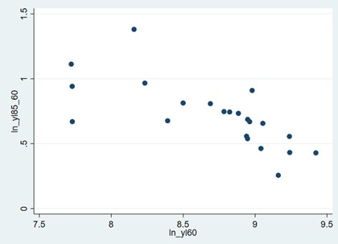
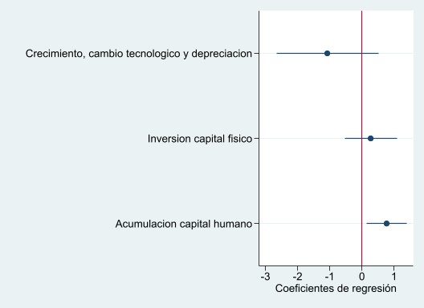

```{r setup, include=FALSE}
knitr::opts_chunk$set(warning = FALSE,
                      error = F, 
                      message = FALSE,
                      echo = FALSE, fig.pos = "H", out.extra = "") 
Sys.setlocale("LC_ALL","ES_ES.UTF-8") # para temas de caracteres en español, recomendable
summarytools::st_options(
  plain.ascii = FALSE, 
  style = "rmarkdown",
  dfSummary.style = "grid",
  dfSummary.valid.col = FALSE,
  dfSummary.graph.magnif = 1.5,
  subtitle.emphasis = FALSE,
  tmp.img.dir = "/tmp",
  lang = "es"
)
```

```{r load pack, echo = F}
# 1. Cargar paquetes ------------------------------------------------------
pacman::p_load(googledrive, easystats, tidyverse, ggthemes,
               sjPlot, sjmisc, summarytools,
               texreg, ggpubr, multcomp, jtools)
theme_set(theme_stata(base_size = 10, base_family = "sans", scheme = "s2color"))
sjPlot::set_theme(theme_stata(base_size = 10, base_family = "sans", scheme = "s2color"))
options(knitr.table.format = "latex")
kable <- function(data) {
  kableExtra::kable(data, booktabs = TRUE, digits = 3) %>% 
    kableExtra::kable_styling(latex_options =c("scale_down"), position = "center")
}

options(knitr.kable.NA = '')
table.expand <- function(cells, cols.width, justify, sep.cols) {
        cells <- enc2native(cells)
        .Call('pander_tableExpand_cpp', PACKAGE = 'pander', cells, cols.width, justify, sep.cols, style)
        .Call('pander_tableExpand_cpp', PACKAGE = 'pander', cells, cols.width, justify, sep.cols, style)
}

```

\thispagestyle{empty} 


\newpage


[Mankiw, Romer & Weil (1992)](https://academic.oup.com/qje/article-abstract/107/2/407/1838296)
testearon la consistencia del modelo de crecimiento de [Solow](https://academic.oup.com/qje/article-abstract/70/1/65/1903777) con datos a nivel país desde 1960 a 1985. Como mostraremos a lo largo de la tarea, para ello los autores estimaron una serie de modelos de regresión lineal a partir del método de Mínimos Cuadrados Ordinarios (*OLS*) de modo de probar si el modelo de [Solow](https://academic.oup.com/qje/article-abstract/70/1/65/1903777) es capaz de predecir cómo la inversión y el crecimiento de la población determinan los **estándares de vida** (ingreso real). En resumidas palabras su trabajo se resume en las siguientes hipótesis

*Objetivo 1:*  Determinar si el modelo teórico de [Solow](https://academic.oup.com/qje/article-abstract/70/1/65/1903777) es consistente empíricamente a nivel mundial. Específicamente, si en el estado estacionario los determinantes del ingreso real de un país muestran ser significativos, seguir la dirección esperada y explicar parte importante de la varianza.

  $H_1$: Mientras que la inversión tiene un efecto positivo y significativo sobre el crecimiento económico, el crecimiento poblacional evidencia uno negativo.

*Objetivo 2*: Estimar especificaciones adicionales respecto a la inversión en capital, que permiten parcializar el efecto del capital físico y humano, corroborar si estas mejoran el ajuste del modelo y lo hacen más estable a la relación capital y producto

  $H_3$: El capital humano tiene un efecto parcial positivo y significativo sobre el crecimiento económico


*Objetivo 3*: Estimar formas funcionales de los determinantes del estándar de vida, de modo de entender mejor la varianza del ingreso real entre los distintos países. 

  $H_3$: Existe una convergencia hacia estándares de vida dado que los países más pobres tienden a crecer económicamente más rápido que aquellos ricos.


En punto inicial surge de evaluar el modelo de [*Solow (1956)*](https://academic.oup.com/qje/article-abstract/70/1/65/1903777) quien parte de una función de producción Cobb-Douglas, donde las variables principales son el **capital** ($K$) y **trabajo** ($L$), y a las que suma un *nivel de tecnología* ($A$) que se define en función de la *tasa de ahorro*[^g] $g$, *crecimiento poblacional* $n$ y *progreso tecnológico* $\delta$. 


$$Y(t) = K (t)^\alpha (A(t) L (t))^{1-\alpha}$$
donde el stock de capital se define como $k = K/AL$, y que en el estado estacionario se evidencia una relación positiva con el ahorro (*s*) y negativa con el crecimiento poblacional(*n*). 

$$
k^* = [\frac{s}{n+g+\delta}]^{\frac{1}{1-\alpha}}
$$

$$
ln (\frac{Y(t)}{L(t)}) = ln A(0) + gt + \frac{\alpha}{1-\alpha}\cdot ln(s_h) - \frac{\alpha}{1-\alpha} \cdot ln(n+g+ \delta)
$$

El primer modelo que [Mankiw, Romer & Weil (1992)](https://academic.oup.com/qje/article-abstract/107/2/407/1838296) estiman es el modelo simple de *crecimiento económico de [*Solow (1956)*](https://academic.oup.com/qje/article-abstract/70/1/65/1903777)*, que considera como verdadero que la elasticidad del ingreso respecto al ahorro ($s$) es *0.5* y *-0.5* al crecimiento poblacional  ($n + g + \delta$).

$$
ln (\frac{Y}{L}) = \alpha + \frac{\alpha}{1-\alpha}\cdot ln(s_h) + \frac{\alpha}{1-\alpha} \cdot ln(n+g+ \delta) + \epsilon
$$


[^g]: para [Mankiw *et. al* (1992)]((https://academic.oup.com/qje/article-abstract/107/2/407/1838296)) representa los avances del conocimiento o tasa de cambio tecnológico

El segundo modelo es 


El tercer modelo es


# Descriptivos

Hemos dejado algunos descriptivos que pueden ser útiles a modo de aproximarnos a las muestras

```{r desc, eval = F}
summarytools::dfSummary((data %>% dplyr::filter(.,n == 1) %>% dplyr::select(.,starts_with("ln"))), 
                                                                                  varnumbers = F, valid.col =  F, na.col = F, freqs.pct.valid = F, headings = F,
                                                                                  graph.magnif = 1.5, style = "grid", 
                                                                                  silent = T,
                                                                                  plain.ascii = F)
```
+-------------+--------------------------------------+---------------------------+-------------------------+----------------------+
| Variable    | Etiqueta                             | Estadísticas / Valores    | Frec. (% sobre válidos) | Gráfico              |
+=============+======================================+===========================+=========================+======================+
| ln_yl85\    | log PIB per cápita (1985)           | Media (d-s) : 8 (1.1)\    | 95 valores distintos    |  |
| [numeric]   |                                      | min < mediana < max:\     |                         |                      |
|             |                                      | 6 < 8.1 < 9.9\            |                         |                      |
|             |                                      | RI (CV) : 1.8 (0.1)       |                         |                      |
+-------------+--------------------------------------+---------------------------+-------------------------+----------------------+
| ln_yl60\    | log PIB per cápita (1960)           | Media (d-s) : 7.6 (0.9)\  | 96 valores distintos    |  |
| [numeric]   |                                      | min < mediana < max:\     |                         |                      |
|             |                                      | 5.9 < 7.5 < 9.4\          |                         |                      |
|             |                                      | RI (CV) : 1.4 (0.1)       |                         |                      |
+-------------+--------------------------------------+---------------------------+-------------------------+----------------------+
| ln_sk\      | log capital físico                  | Media (d-s) : -1.8 (0.5)\ | 83 valores distintos    |  |
| [numeric]   |                                      | min < mediana < max:\     |                         |                      |
|             |                                      | -3.2 < -1.8 < -1\         |                         |                      |
|             |                                      | RI (CV) : 0.7 (-0.3)      |                         |                      |
+-------------+--------------------------------------+---------------------------+-------------------------+----------------------+
| ln_ngdelta\ | Crecimiento, cambio tecnologico y    | Media (d-s) : -2.6 (0.1)\ | 34 valores distintos    |  |
| [numeric]   | depreciacion                         | min < mediana < max:\     |                         |                      |
|             |                                      | -2.9 < -2.6 < -2.4\       |                         |                      |
|             |                                      | RI (CV) : 0.2 (0)         |                         |                      |
+-------------+--------------------------------------+---------------------------+-------------------------+----------------------+
| ln_sh\      | log Capital humano                   | Media (d-s) : -3.2 (0.9)\ | 64 valores distintos    |  |
| [numeric]   |                                      | min < mediana < max:\     |                         |                      |
|             |                                      | -5.5 < -3 < -2.1\         |                         |                      |
|             |                                      | RI (CV) : 1.2 (-0.3)      |                         |                      |
+-------------+--------------------------------------+---------------------------+-------------------------+----------------------+
| ln_yl85_60\ | log PIB por trabajador inicial-final | Media (d-s) : 0.4 (0.4)\  | 98 valores distintos    |  |
| [numeric]   |                                      | min < mediana < max:\     |                         |                      |
|             |                                      | -0.7 < 0.4 < 1.7\         |                         |                      |
|             |                                      | RI (CV) : 0.6 (1)         |                         |                      |
+-------------+--------------------------------------+---------------------------+-------------------------+----------------------+

# Pregunta 1

La hipótesis que se buscó probar por parte de [Mankiw et. al (1992)]((https://academic.oup.com/qje/article-abstract/107/2/407/1838296)) es de si el modelo de crecimiento económico de *Solow* es consistente con la evidencia empírica ($H_1$). La importancia de ello surge de que durante esos años la macroeconomía puso en cuestión dicho modelo por el carácter exógeno de sus determinantes, y por ello, se propusieron construir modelos de regresión especificando el ahorro y crecimiento poblacional como *independientes* del error de estimación (y en eso la importancia de los modelos *OLS*).

Para efectos de la tarea tomaremos el último modelo considerando $\frac{\alpha}{1-\alpha} = \beta$, y supondremos que g + $\delta$= 0.05 (tal como hace [Mankiw et al (1992)](https://academic.oup.com/qje/article-abstract/107/2/407/1838296))

$$
ln (\frac{Y}{L}) = \beta_o + \beta_1\cdot ln(s_h) + \beta_2 \cdot ln(n+g+ \delta) + u
$$

donde definiremos como

- $\frac{Y}{L}$:  el producto (PIB) per cápita para la población en edad de trabajar (1985)
- $s_k$: $\frac{I}{Y}$ tasa de inversión en capital físico
- $n$: tasa de crecimiento de la población en edad de trabajar (1985)
- $g$: tasa de cambio tecnológico
- $\delta$: tasa de depreciación

## 1.1 Estime la ecuación por MCO para cada submuestra de países.


**Tabla 1**. Modelos de regresión lineal que estiman log GDP por trabajador 1985
```{r tab1}
tab1 <- readxl::read_xls("../report2/output/tab/tabla1_1.xls", skip = 2)
tab1 %>%
  dplyr::select(Predictores = 1, "Non-oil" = 2 , "Intermediate" = 3 , "OECD" = 4) %>%
  slice(-c(1,2)) %>% 
  kableExtra::kable(., booktabs = T) %>% kableExtra::kable_styling(latex_options =c("HOLD_position","scale_down"), position = "center")
```

# 1.2 Interpretar

En términos generales, los resultados del modelo reportado en la *Tabla N°1* se condicen con las estimaciones realizadas por Makinw et. al (1992), tanto en términos de dirección, tamaño efecto como ajuste de los modelos. Ahora bien, los resultados no son idénticos al menos con 3 cifras significativas, por lo que no podemos plantear una replicación del artículo. Por ello, a continuación interpretaremos y contrastaremos cada uno de los resultados. 


### Inversión de capital físico

Primero, respecto al efecto parcial de la inversión de capital físico sobre el crecimiento económico, controlando por el crecimiento poblacional, podemos decir que con un 99% de confianza existe evidencia sustantiva que indica un *efecto positivo* de la tasa de inversión en capital físico sobre el crecimiento económico. De manera más precisa, en la submuestra de países que producen principalmente **petróleo** (*Non-oil*) si se genera un aumento en 1% de la tasa de inversión capital físico, la tasa de crecimiento anual del PIB real aumentaría en **1,423%** puntos porcentuales, controlando por el resto de las variables del modelo. Un resultado similar ocurre con los países con población intermedia donde el aumento en 1% de $s_k$, produce un aumento de  **1,318%** (*p < 0.001*). No podemos llegar a la misma conclusión en el caso de los países OECD, donde con un 95% de confianza no podemos rechazar la hipótesis nula que indica que el predictor no tiene un efecto sobre la tasa de crecimiento ($\beta = 0$).


Podemos notar que los coeficientes y significancia[^sig] asociados a la inversión de capital físico se reproducen a los reportados por los autores para las tres muestras (1,42%, 1,31% y 0.5, respectivamente). De manera similar, tomando la elasticidad del ingreso respecto a la inversión del capital ($\beta_{1-non-oil}$) para el modelo *Non-oil*, podemos obtener un $\alpha_{r-non-oil} = 0,5872$ que es cercano al obtenido por [Mankiw et. al (1992)]((https://academic.oup.com/qje/article-abstract/107/2/407/1838296)) ($\alpha_{o-non-oil} = 0,60$), esto es, la relación entre capital e ingresos. Podemos extender este hallazgo al modelo *Intermediate* y *OECD* ($\alpha_{r-int}=0,5671 \land \alpha_{o-int}= 0,59$ y $\alpha_{r-oecd}=\frac{1}{3} \land \alpha_{o-int}= 0,36$).

### Crecimiento poblacional, cambio tecnológico y depreciación

Segundo, en general nos referiremos a crecimiento poblacional en la medida en que se asume que la depreciación ($\delta$) y  tasa de cambio tecnológico ($g$) son constantes entre países[^constant], por lo que la diferencia en el crecimiento poblacional es lo que define la elasticidad reportada. A este respecto podemos decir que con un 99% de confianza existe evidencia sustantiva que indica un *efecto negativo* del crecimiento de la población sobre el crecimiento económico, tal como [*Solow (1956)*](https://academic.oup.com/qje/article-abstract/70/1/65/1903777) había propuesto. 

Podemos notar que en la submuestra de países *"Non-oil"* un aumento en 1% de $n + g + \delta$, la tasa de crecimiento anual del PIB real disminuye en **1,990%** puntos porcentuales, controlando por la tasa de inversión en capital físico. Del mismo modo, en los países *"Intermediate"* un aumento en 1% del predictor, produce una disminución de **-2,017%** del crecimiento económico( también con un 99% de confianza). Al igual que en análisis de la inversión en capital físico, los modelos estimados con la submuestra *OECD* no muestran ser significativos a un 95% de confianza, por lo que en ese caso no podemos rechazar la hipótesis nula que indica que el predictor no tiene un efecto sobre la tasa de crecimiento económico ($\beta = 0$).


Respecto a la replicación de estimaciones, los coeficientes y significancia asociados al crecimiento poblacional son *similares* a los reportados por los autores para las tres muestras (-1.97%, -2.01% y -0.76, respectivamente). También volvemos a analizar el valor estimado de $\alpha$, pero ahora asociada a la *elasticidad del ingreso respecto al crecimiento poblacional, cambio tecnológico y depreciación*. Notemos que si bien se propone un único valor de $\alpha$ en el modelo (pero contrario en signos), aún no hemos probado realmente si esta hipótesis es cierta (lo que veremos en el siguiente punto).  Por consiguiente obtenemos similares $\alpha$, pero más alejados que para la elasticidad anterior: Para *"Non-oil"* $\alpha_{r-non-oil}= 0,66 \land \alpha_{o-non-oil}= 0,59$; *"Intermediate"* $\alpha_{r-int}= 0,66 \land \alpha_{o-int}= 0,59$ y *"OECD"* $\alpha_{r-oecd}= 0,43 \land \alpha_{o-int}= 0,36$.

[^constant]: el primero pues no hay datos y el segundo por intuición económica de los autores 

[^sig]:Para obtener la significancia del artículo se debe obtener el estadístico t observado ($t_o = \frac{\beta_j}{se}$) y ser comparado con el estadístico t de contraste.


### Bondad de ajuste


Tal como indica [*Mankiw et. al (1992)*]((https://academic.oup.com/qje/article-abstract/107/2/407/1838296)), el modelo explica parte importante de la variación entre los países respecto al crecimiento económico (o ingreso real). De manera más precisa, en los países con producción industrial principalmente petrolera, la inversión y el crecimiento de la población explica en un 59,2% la varianza del PIB per cápita ($\bar{R}^2_{r-non-oil} = 0,592 \land \bar{R}^2_{o-non-oil} = 0,59$). La bondad de ajuste del modelo para los países intermedios también reporta ser importante: cerca de un 58,8% de la variación del producto por trabajador es explicada por la varianza en nuestros predictores ($\bar{R}^2_{r-int} = 0,588 \land \bar{R}^2_{o-int} = 0,59$). Este buen escenario dista de ser igual para los países *OECD* en tanto el ajuste solo alcanza un 1,2% ($\bar{R}^2_{r-oecd} = 0,012 \land \bar{R}^2_{o-oecd} = 0,01$).

Como se puede notar, los *R cuadrado ajustado* por nuestro equipo y [Mankiw et. al (1992)]((https://academic.oup.com/qje/article-abstract/107/2/407/1838296)) son muy similares ($\bar{R}^2_{r} \approx  \bar{R}^2_{o}$).


# 1.3 Contraste hipótesis (combinación lineal)

Recordemos que cuando revisamos el modelo propuesto por [Solow](https://academic.oup.com/qje/article-abstract/70/1/65/1903777), notamos que se planteaba que las elasticidades respecto al ingreso real eran iguales en magnitud pero de distinto signo (tal como se puede evidenciar *claramente* en la tercera ecuación reportada). Por ello, probaremos la siguiente hipótesis para cada una de las submuestras[^h1]

$$H_0 : \beta_1 + \beta_2 = 0 \\
H_1 : \beta_1 + \beta_2 \neq 0$$


El estadístico que nos permitió hacer ese contraste es el *estadístico F*. En la **Tabla 1.2** podemos ver un resumen de nuestros resultados. Para las tres submuestras podemos afirmar que con un 95% de confianza no se puede rechazar la hipótesis nula. Esto quiere decir de que no hay evidencia suficiente para afirmar lo propuesto por *Solow*, esto es, que el efecto parcial de la inversión y el crecimiento poblacional es igual en magnitud pero distinto en signo.

**Tabla 1.2** Test restricciones múltiples para elasticidades del crecimiento económico

|  | **Non-oil** | **Intermediate** | **OECD** |
|---|---|---|---|
| F(q, n-k-1) | F(1, 95) = 0,83 | F(1,72) = 1,29 | F(1,19)=0,06 |
| p-value | 0,3634 | 0,2592 | 0,8086 |

Pese a que los autores del artículo no muestran la evidencia, llegan a la misma conclusión que hemos indicado. De hecho, no solo los coeficientes son estadísticamente distintos (con un 5% de error), sino que también la magnitud obtenida es mayor a la propuesta teóricamente. De manera más precisa, el modelo teórico de *Solow* propone un $\alpha = \frac{1}{3}$, mientras que los modelos que hemos calculado tienen en promedio un $\alpha = 0,59$. Dicho eso, el modelo empírico sobre-estima el impacto de la inversión y el crecimiento de la fuerza de trabajo. Comentaremos ese punto en lo que viene

[^h1]: Lo que es equivalente a lo teateado por [Mankiw et al. (1992)]((https://academic.oup.com/qje/article-abstract/107/2/407/1838296)) $H_0 : \frac{\alpha_1}{1-\alpha_1} + \frac{\alpha_2}{1-\alpha_2} = 0$


### Síntesis sobre hallazgos


Iniciamos este análisis mencionando que la hipótesis que se buscó probar por parte de [Mankiw et. al (1992)]((https://academic.oup.com/qje/article-abstract/107/2/407/1838296)) es de si el modelo de crecimiento económico de *Solow* es consistente con la evidencia empírica ($H_1$).

En términos empíricos, nos sumamos a los hallazgos encontrados por [Mankiw et. al (1992)]((https://academic.oup.com/qje/article-abstract/107/2/407/1838296)) respecto al modelo teórico de [Solow](https://academic.oup.com/qje/article-abstract/70/1/65/1903777). Esto quiere decir que en términos generales hemos obtenido las mismas estimaciones que los investigadores. Con eso cumplimos con dar más evidencia a la primera hipótesis del artículo ($H_1$).

En términos sustantivos, tanto los autores del artículo como nosotros nos enfocamos en revisar dos resultados y un supuesto del modelo teórico de *Solow*

**1. Coeficientes($\hat{\beta}$):** la dirección y significancia de las relaciones estimadas son las planteadas teóricamente. Esto quiere decir que se predice que países con una mayor inversión en capital físico tienen un mayor ingreso real; así como países con mayor crecimiento poblacional tienen menores ingresos reales.

En términos económicos ambas variables tienen sentido, en la medida en que una mayor inversión en capital produce más medios para aumentar la producción, lo que tiene como correlato un aumento en los estándares de vida (*ceteris paribus*). Mientras que un aumento en la población disponible para trabajar disminuye el estándar de vida en términos agregados, toda vez que esto puede implicar un aumento de la población de reserva (ya sea en personas desempleadas o inactivas laboralmente). 

**3. Tamaño de efecto de coeficientes(test de combinación):**  no solo son distintos, sino que su tamaño efecto es diferente al propuesto. De hecho, si se parte estimando los modelos con el valor propuesto por *Solow* (método growth accountain), la bondad de ajuste promedio de las submuestras cae significativamente de 0,59 a 0,28 ($\bar{R^2}$)

Siguiendo con la interpretación anterior, es esperable que el efecto parcial de este "contaminado" con el efecto parcial de otros predictores. De manera exploratoria pensamos que esto podría implicar una interacción de estos, o que existan otros factores como el capital humano que especifiquen mejor el modelo.

**2. Bondad de ajuste($\bar{R^2}$):** el modelo explica parte importante de la varianza de la variable dependiente (sobre un 50% en el caso de la submuestra "Non-oil" e "Intermediate")

Pese a que las elasticidades tienen sentido económico, son significativas y la bondad de ajuste también es alta *aun no se puede decir que el modelo es exitoso* considerando que si estimamos el modelo con las soluciones estacionarias de las elasticidades, el ajuste del modelo cae significativamente. Esto proviene de dos problemas que trataremos de discutir en la pregunta N°2 y N°3. La primera tiene que ver con el sesgo de variable omitida y la segunda con el problema de heterocedasticidad, dos problemas frecuentes en modelos macroeconómicos a nivel país[^ocde]

[^ocde]: De hecho, no es casual que los resultados para los modelos *OECD* no den significativos y divergan tanto de los otros modelos. Esto se debe a que principalmente existe poca varianza tanto en la variable dependiente como en los predictores del modelo, junto con que el tamaño de las observaciones es muy pequeño (problemas de identificación). El otro caso que se da en estudios como estos es cuando la medición de los predictores está asociada al error pues muchas veces tener valores de estos países está asociado a niveles de desarrollo, robustez institucional, etc. También ocurre cuando países más ricos tenderán a tener más ahorros, mientras que países más pobres mayores niveles de crecimiento poblacional (la varianza del error no será constante, y probablemente dependa de los parámetros desde los cuales estamos estimando los modelos).


\newpage

# Pregunta 2

En este apartado testeamos el segundo objetivo que tuvieron [Mankiw, Romer & Weil (1992)]((https://academic.oup.com/qje/article-abstract/107/2/407/1838296)), esto es, especificaciones adicionales al modelo que parcializan el efecto del capital físico y humano sobre el crecimiento económico, esto ante los problemas reportados en el modelo N°1 (discutido en Pregunta 1). 

El modelo estimado por los autores es el siguiente

$$
ln (\frac{Y}{L}) = \beta_o + \beta_1\cdot ln(n+g+ \delta) + \beta_2 \cdot ln(s_k) + \beta_3 \cdot ln(s_h)  + u
$$

donde

- $\frac{Y}{L}$:  el producto por trabajador
- $s_k$: $\frac{I}{Y}$ tasa de inversión en capital físico
- $s_h$: tasa acumulación en capital humano (medido en escolaridad)
- $n$: tasa de crecimiento de la población en edad de trabajar
- $g$: tasa de cambio tecnológico
- $\delta$: tasa de depreciación.


## 2.1 Estimación

Como se puede observar en nuestra *Tabla N°2*,  hemos podido replicar con un alto grado de precisión las estimaciones de la *tabla 2* reportada por los autores [Mankiw et. al (1992, p.421)]((https://academic.oup.com/qje/article-abstract/107/2/407/1838296)), la cual muestra los efectos parciales de las distintas variables independientes sobre el producto por trabajador para las distintas submuestras, siendo estas variables $s_k; s_h; ln(n + g + \delta)$ 

A modo de ejemplo, respecto a la replicación de estimaciones, los coeficientes y significancia[^sig-2] asociados al **acumulación de capital humano** son *similares* a los reportados por los autores para las tres muestras:

- Para nuestro reporte la elasticidad crecimiento económico respecto a acumulación de capital humano es $\beta_{3r-non-oil} = 0,65; \beta_{3r-int}= 0,731; \alpha_{3r-oecd}= 0,768 $.

- Para el artículo de los autores es $\beta_{o-non-oil} = 0,66; \beta_{o-int}= 0,73; \beta_{o-oecd}= 0,76$

Solo con este ejemplo queremos mostrar que aun incorporando una nueva variable en el modelo, hemos podido obtener los mismo resultados que los autores. 

[^sig-2]: Para obtener la significancia del artículo se debe obtener el estadístico t observado ($t_o = \frac{\beta_j}{se}$) y ser comparado con el estadístico t de contraste.

**Tabla 2**. Modelos de regresión lineal que estiman log GDP por trabajador 1985
```{r tab2}
tab2 <- readxl::read_xls("../report2/output/tab/tabla1_2.xls", skip = 2)
tab2 %>%
  dplyr::select(Predictores = 1, "Non-oil" = 2 , "Intermediate" = 3 , "OECD" = 4) %>%
  slice(-c(1,2)) %>% 
  kableExtra::kable(., booktabs = T) %>% kableExtra::kable_styling(latex_options =c("HOLD_position","scale_down"), position = "center")
```

# 2.2 Interpretación de la acumulación de capital humano

En primer lugar, cabe mencionar que la *school* refiere al porcentaje de la población en edad de trabajar con educación secundaria (promedio anual del período 1960-1985). A modo de aclaración metodológica, es importante recalcar que esta variable es la utilizada por Mankiw y sus colaboradores para hacer referencia a la *acumulación de capital humano*, y de esta manera estimar su efecto en el modelo de [Solow](https://academic.oup.com/qje/article-abstract/70/1/65/1903777). Los autores de este estudio comenzaron obteniendo los datos de la fracción de la población elegible (de 12 a 17 años) matriculada en la escuela secundaria, los que lograron conseguir del anuario de la UNESCO. Luego multiplicaron esta tasa de matrícula por la fracción de la población en edad de trabajar que está en edad escolar, para obtener finalmente la variable mencionada.

Al aplicar logaritmos y estimar ahora la regresión podremos evidenciar la sensibilidad del crecimiento económico respecto a la *acumulación de capital humano*. Podemos interpretar y concluir que para las distintas submuestras, un aumento de 1% en el porcentaje de la población en edad de trabajar con educación secundaria se asocia a un aumento de $\beta_3$ % en el producto por trabajador, medida del crecimiento económico utilizada por los economistas.

De esta manera, y más precisamente para la muestra analizada, un aumento de 1% en el porcentaje representado por la variable *school* se asocia (en promedio y manteniendo todo lo demás constante) con un aumento de 0,65% en el producto por trabajador en los **países non-oil**, 0,73% en los **países intermedios** y 0,77% en los **países pertenecientes a la OECD**, todos efectos positivos y estadísticamente significativos. Tal como indicamos arriba estos resultados se condicen con la conclusión de Mankiw, Romer y Weil (1992) acerca de que la medida de capital humano entra positiva y significativamente en las tres submuestras y mejora el rendimiento del modelo de crecimiento de [Solow](https://academic.oup.com/qje/article-abstract/70/1/65/1903777).

Respecto a la significancia estadística podemos indicar que en las tres submuestras analizadas, los coeficientes que acompañan a la variable *Acumulación de capital humano* (*ln(school)*) son estadísticamente significativos con un 5% de error, tras el análisis de las regresiones y los valores-p asociados a los coeficientes en la pregunta anterior, que es exactamente lo que los economistas autores de este informe intentaban probar al incorporar capital humano al modelo de crecimiento económico de [Solow](https://academic.oup.com/qje/article-abstract/70/1/65/1903777). De hecho, como podemos ver en la tabla N°2 en la submuestra de países **non-oil e intermediate** la significancia alcanza un 99% de confianza $\beta_{3r-non-oil} = p-value < 0,01; \beta_{3r-int}= p-value < 0,01; \beta_{3r-oecd}= p-value < 0,05$

# 2.3 Hipótesis (combinación lineal)


En el estudio que buscamos replicar, se concluye matemáticamente que las distintas economías convergen a un estado estacionario de capital físico y humano por trabajador efectivo, funciones que al ser reemplazadas en el modelo de producción en cuestión y aplicando logaritmos, nos arrojan lo siguiente:


$$
ln (\frac{Y(t)}{L(t)}) = ln A(0) + gt - \frac{\alpha + \beta}{1-\alpha - \beta}\cdot(n+ g + \delta) + \frac{\alpha}{1-\alpha - \beta}\cdot ln(s_k) + \frac{\beta}{1-\alpha - \beta}ln(s_h)
$$
La ecuación anterior pone de manifiesto que los coeficientes que acompañan a las variables independientes de la regresión dependen a la vez de $\alpha$ (participación del capital físico en los ingresos) y $\beta$ (participación del capital humano en los ingresos). Si tomamos esos coeficientes y los sumamos estos deben ser igual a 0.

Esta hipótesis la estimamos como la hipótesis nula que indica que $H_o = \beta_1 + \beta_2 + \beta_3 = 0$, cuyos resultados podemos ver en la **Tabla 2.3**. Con un 95% de confianza no podemos rechazar la hipótesis nula para las tres submuestras. Como se puede ver en el *valor p* asociado a la *prueba F* que nos permite testear esta restricción múltiple, las probabilidades de no rechazar la hipótesis nula es bastante alta (en los 3 casos los valores p son mayores a 0,05). Esto quiere decir que **la suma de los coeficientes** que acompañan a las variables independientes (que representan los efectos parciales sobre la variable de interés) es igual a 0, por lo que se confirma lo planteado en el paper de Mankiw, Romer y Weil. 


**Tabla 2.3** Test restricciones múltiples para elasticidades del crecimiento económico

|  | **Non-oil** | **Intermediate** | **OECD** |
|---|---|---|---|
| F(q, n-k-1) |  F(1 , 94) = 0,74 | F(1 , 71) =0.02 | F(1  ,18) = 0.00 |
| p-value | 0,3904| 0,8828 | 0,9711 |


\newpage

# Pregunta 3


Tal como comentábamos al inicio de esta tarea, uno de los propósitos que tomaron los autores para estimar la coincidencia empírica del modelo de [Solow](https://academic.oup.com/qje/article-abstract/70/1/65/1903777) es que en los últimos años las propuestas más modernas de modelos de crecimiento económico plantearon que más bien el crecimiento era **endógeno**, poniendo en tensión al modelo clásico de *Solow*. Estos modelos se caracterizan por asumir retornos no decrecientes de los factores de producción (algo que ocurriría en nuestro último modelo si $\alpha + \beta = 1$, es decir, que los modelos no convergen). Las implicancias de esto son relevantes dado que las predicciones de estos modelos endógenos y el de [Solow](https://academic.oup.com/qje/article-abstract/70/1/65/1903777) son bastante diferentes dado que no *hay un estado estacionario del nivel de ingreso*, **las diferencias entre países difiere sustantivamente y persiste de manera indefinida** (*ie. no hay convergencia*), todo eso controlando por la tasa de inversión y el crecimiento poblacional[^sol-endo].

En ese sentido, un primer objetivo que abordademos es la de reexaminar la evidencia sobre la convergencia de los modelos ($\lambda$). Luego, buscaremos generalizar estos resultados previos incorporando una de las discusiones y conclusiones de la *Pregunta 2*, esto es, la importancia de la *acumulación de capital humano* y *crecimiento poblacional*. Respecto a ello, en la tercera parte de esta pregunta probaremos si estos determinantes difieren en el estado estacionario entre los países[^var-paises]

Para ello hemos supuesto que  en 1985 los países están en estado estacionario[^ss]. Luego, al igual que Mankiw et. al (1992) y [Solow](https://academic.oup.com/qje/article-abstract/70/1/65/1903777), identificaremos la velocidad de convergencia $\lambda$ (entre menor sea, más rápida es la convergencia y con este valor podemos obtener en cuántos años la economía converge). El modelo condicional[^cond] se define como:

$$
ln (\frac{Y(t)}{L(0)}) = (1-e^{\lambda t})\cdot \frac{\alpha - \beta}{1-\alpha - \beta}\cdot ln(n+ g + \delta) + (1-e^{\lambda t})\cdot \frac{\alpha}{1-\alpha - \beta}\cdot ln(s_k) + (1-e^{\lambda t})\cdot \frac{\beta}{1-\alpha - \beta}ln(s_h) - (1-e^{\lambda t})\cdot ln(y(0))
$$
Mientras que el modelo incondicional

$$
ln (\frac{Y(t)}{L(0)}) =  (1-e^{\lambda t})\cdot ln(y(0))
$$

Entonces probaremos en ambos modelos que si los $\hat \beta_j$ no son significativos, podría ocurrir que

$$\hat \beta = 0 \Longrightarrow 0 = 1-e^{\lambda t} \\
e^{\lambda t}= 1 \\
\lambda t=1$$

En estado estacionario $t es constante$, y por enunciado nos plantearon que estos fuesen **negativos**. De manera implícita eso significa que si son distintos de cero y menores a 0 definiremos de manera más estrictira de que sean diferentes o mayores a 1, lo que podría producir o una indeterminación del modelo o un crecimiento que no converge (se puede probar matemáticamente).

[^ss]: en términos econométricos al igual que Mankiw. et al (1992) suponemos que las desviaciones respecto al estado estacionario son aleatorias. 

[^var-paises]: esto es, existe alta intervarianza entre el efecto que tienen estos predictores sobre los países.

[^sol-endo]: para estos modelos la variable instrumental que corrige la endogeneidad del modelo de [Solow](https://academic.oup.com/qje/article-abstract/70/1/65/1903777) es el **balance de los sectores económicos** que afecta al crecimiento inicial de cada país (cf. [Barro (1991)](https://academic.oup.com/qje/article-abstract/106/2/407/1905452))

[^cond]: Condicionalidad a los factores que se han definido como relevantes para la estimación del crecimiento


## 3.1 Estimación de convergencia en modelos incondicionales

El primer paso es analizar la convergencia incondicional. Este tipo de convergencia implica que la tasa de crecimiento del producto por trabajador debe estar negativamente relacionada con el nivel de producto por trabajador inicial. Estimamos esta ecuación de convergencia para cada submuestra usando 1960 como año de referencia inicial:

$$
ln (\frac{Y_1985}{L_1985}) - ln (\frac{Y_1960}{L_1960}) = \beta_o + \beta_1\cdot ln (\frac{Y_1960}{L_1960})  + u
$$


### 3.1.1 Tabla

**Tabla 3**. Modelos de regresión lineal que estiman convergencia incondicional
```{r tab3}
tab3 <- readxl::read_xls("../report2/output/tab/tabla1_3_1.xls", skip = 2)
tab3 %>%
  dplyr::select(Predictores = 1, "Non-oil" = 2 , "Intermediate" = 3 , "OECD" = 4) %>%
  slice(-c(1,2)) %>% 
  kableExtra::kable(., booktabs = T) %>% kableExtra::kable_styling(latex_options =c("HOLD_position","scale_down"), position = "center")
```

### Países "Non-oil"

Para países pertenecientes a la submuestra de *Non-Oil*, el regresor que indica la relación del PIB per cápita inicial con crecimiento promedio del PIB en el periodo de estudio es positivo y no significativo estadísticamente al 5%, *ceteris paribus*. Ahora bien, con un 90% de confianza si podemos rechazar la hipótesis nula, es decir, que es probable esperar (con un 10% de error) un efecto positivo de crecimiento inicial sobre el crecimiento en 1985. De manera más precisa, por cada 1% que aumente el crecimiento inicial, en promedio tendremos un cambio de un 0.094% del crecimiento en 1985, *ceteris paribus*. Notemos dos cosas al respecto de estos países:

1. No hay evidencia de convergencia incondicional para ningún nivel de confianza porque la relación entre las variables en cuestión para esta submuestra es positiva.

2. Cabe destacar que el hecho de ser un país *non-oil* ya tiene una desventaja en el crecimiento promedio del PIB (la constante es negativa) y, por ende, en la riqueza del país (al menos para el periodo de estudio). 


### Países "Intermediate"

Ahora bien, en la submuestra de países intermedios el coeficiente de regresión si bien es negativo, no es significativo estadísticamente a un 95% de confianza (p = 0.0548), *ceteris paribus*. Por lo tanto, si bien se cumple la relación esperada en términos de dirección, no  podemos hacer ninguna inferencia con confianza, esto es, plantear que por cada 1% que aumente el crecimiento inicial en estos países, se producirá una disminución en promedio de 0,004%, *ceteris paribus*. Entonces, debido a lo anterior, no podemos afirmar la existencia de convergencia incondicional para esta submuestra. 

Es interesante notar la interpretación que tienen los interceptos en estos casos. La constante es positiva, lo que sugiere que tener más de un millón de habitantes tiene un efecto positivo en la tasa de crecimiento promedio del PIB per cápita. Sin embargo, no hay evidencia para afirmar lo anterior porque no hay significancia estadística (p = 0.4329).

### Países "OECD"


Para la submuestra de países que pertenecen a la OECD, la elasticidad del crecimiento inicial sobre el crecimiento en 1985 es negativo y significativo, *ceteris paribus*. Así, un aumento de 1% en el PIB per cápita inicial  genera una disminución de 0,34% en el crecimiento promedio del PIB en el periodo descrito. A partir de la tabla reportada podemos afirmar que existe significancia estadística, ya que, el valor p es muy pequeño (significativo incluso al 1%). Económicamente también es importante porque una disminución de 0,34% en el promedio de crecimiento anual del PIB para un periodo de **25 años es muy notorio, en especial considerando el efecto de una tasa compuesta y de que se debe a una variación de tan solo 1% en el PIB per cápita inicial**. Por lo tanto, como hay evidencia de una relación negativa entre las variables de estudio, podemos concluir que los países en la submuestra perteneciente a la OECD presentan **convergencia incondicional**. Por otro lado, la constante es positiva, de una magnitud importante y tiene significancia estadística.

#### Discusión sobre resultados

La diferencia entre los resultados recién descritos tienen sentido según la hipótesis que se están planteado. Recordemos que se busca mostrar que los países convergen a un mismo estado estacionario de crecimiento económico. Como podemos notar esto solo se cumple para los países OECD (solo en este caso la velocidad de convergencia es estadísticamente significativa). El sentido de ello es que no es sorpresa que los países miembros de la OECD son parte de este grupo dado ciertos indicadores de desarrollo económico, por lo que podemos concluir dos cosas a este respecto: primero, el resultado puede contener un sesgo de selección importante dado que su nivel de crecimiento económico depende de haber gozado de un crecimiento alto para haberse desarrollado económicamente; y segundo, que esto nos llega a hipotetizar que esa es la razón de porque el intercepto es positivo en este caso. 

### 3.1.2 Graficar los modelos incondicionales

Ahora bien, tal y como hicieron los autores (p.427), nos parece importante evaluar el tamaño efecto de los efectos parciales gráficamente, de modo de entender de manera más clara el argumento de la convergencia incondicional. Para ello ocuparemos dos tipos de figuras

1. Una similar a la propuesta en el artículo (*gráficos de dispersión*) que nos permite ver tendencias.

2. Una de coeficientes (*forest-plot*) que nos permite evaluar el error de precisión asociado al coeficiente. 


### Figuras para modelos de convergencia incondicional *Non-oil*

```{r conv-in-n1, results='asis', fig.cap="Modelo de convergencia incondicional - Non Oil"}

```

```{r conv-in-n, results='asis', fig.cap="Coeficiente de modelo de convergencia incondicional - Non Oil"}

```

Sabemos por la *Tabla N°3* que si nuestro nivel de confianza es a un 95%, no podemos plantear que exista significancia estadística para este caso. De manera similar, en la figura de dispersión (*Figura N°1*) podemos ver que la tendencia positiva es casi *inexistente* entre el crecimiento económico inicial (1960) y crecimiento económico en 1985. Ahora bien, lo que más nos aporta esta figura es el alto grado de dispersión de las observaciones. Esto se apoya con la figura siguiente (*Figura N°2*), dado que podemos ver que la precisión de la estimación es bastante baja y por lo mismo el intervalo de confianza es tan grande que es probable que pueda ser igual a cero (tocando línea roja). Nuevamente enfatizamos que no hay evidencia de convergencia incondicional a un 95% de confianza, probablemente dado algo que plantearon los modelos endógenos, esto es, que el estado estacionario entre los países no es el mismo. 


### Figuras para modelos de convergencia incondicional *Intermediate*

```{r conv-in-i1, results='asis', fig.cap="Modelo de convergencia incondicional - Intermediate"}

```

```{r conv-in-i, results='asis', fig.cap="Coeficiente de modelos de convergencia incondicional - Intermediate"}
knitr::include_graphics("../report2/output/figure-plot-modelo3_i.jpg")
```

De manera similar, las estimaciones contenidas en la *Tabla N°3* nos indican que si nuestro nivel de confianza es a un 95%, no podemos plantear que exista un efecto del crecimiento inicial sobre el crecimiento en la fecha evaluada. Como podemos ver en la *Figura N°3*, en el caso de la submuestra de países intermedios observamos una dispersión mucho más grande[^het-int]. De hecho, gráficamente no podemos establecer ninguna conclusión ni relación entre las variables. Lo que si, podemos evidenciar que los países que inician con un PIB per cápita más bajo crecen más rápido, podemos afirmar que no hay evidencia de que haya convergencia incondicional (como los países pobres no crecen más rápido que los ricos no hay una convergencia en el nivel del PIB).
Sumado a esta interpretación, la *Figura N°4* nos permite evidenciar con más fuerza esta idea: no solo existe un alto grado de dispersión que hace que el intervalo de confianza sea muy grande, sino que también el efecto es tan débil que es probable que este sea cero (la estimación puntual de $\beta$ está muy cerca de ser cero).

[^het-int]: Probablemente esta heterogeneidad se deba a los criterios que definen esta muestra.

### Figuras para modelos de convergencia incondicional *OECD*

```{r conv-in-o1, results='asis', fig.cap="Modelo de convergencia incondicional - OECD"}

```

```{r conv-in-o, results='asis', fig.cap="Coeficiente de modelos de convergencia incondicional - OECD"}

```

Si bien ya sabemos por la estimación del modelo para la submuestra de países *OECD* si existe evidencia a un 95% de confianza de convergencia incondicional, de manera gráfica podemos aportar dos elementos sustantivos (*Figura N°5 y N°6*):

1. Para los países miembros de la OECD podemos apreciar una relación inversa (negativa) entre la tasa de crecimiento promedio del PIB per cápita y el PIB per cápita inicial. Esto se traduce en que los países que inicialmente tienen un PIB per cápita más bajo registran una tasa de crecimiento del mismo más alta que los países inicialmente más ricos. Por ende, convergen incondicionalmente (así en la *Figura N°6* notaremos que el límite superior e inferior del $\hat \beta$ no está cerca del cero y por ello no aparece la línea roja)

2. Si bien existe una tendencia clara y habíamos planteado una homogeneidad entre los países, *sí* existe varianza entorno a los niveles iniciales de crecimiento económico (1960), y gracias a ello podemos plantear que existe una relación entre este factor inicial de crecimiento y su resultado. Sumado a ello, al menos descriptivamente no se evidencian *outliers* que estén sesgado esta relación (esta información la obtenemos sobre todo de la *Figura N°5*).

## 3.2 Estimación de convergencia en modelos condicionales

Luego de esas estimaciones, Mankiw et. al (1992) estimaron dos grupos de modelos que aportaron de manera importante a la discusión y hallazgos sobre la convergencia, ahora bien controlando por variables que habíamos considerado como relevantes en los modelos reportados en la *pregunta N°1 y N°2*. Estos hallazgos permiten no solo indicar convergencia de crecimiento económico *dados ciertos factores observables o medibles* de los países, sino que plantear en *cuánto tiempo esa convergencia ocurriría* según los datos. Esto no quita, nuevamente, que evaluemos la velocidad de la convergencia dado los valores de $\lambda$, solo que ahora considerando todos las variables del siguiente modelo (el mismo que reportaron los autores en la *Tabla V* (p.429)). Esto último implica que implícitamente estaremos evaluando que todos los $\hat \beta$ sean distintos de cero [^ideal] (dado que todos ellos están definidos inversamente por un $\lambda$ y por la restricción de que $\alpha + \beta \neq 1$)

$$
ln (\frac{Y_1985}{L_1985}) - ln (\frac{Y_1960}{L_1960}) = \beta_o + \beta_1\cdot ln (\frac{Y_1960}{L_1960})  + \beta_2 \cdot ln(n + g + \delta)+ \beta_3 \cdot ln(s_k) + \beta_4 \cdot ln(s_h) +  u
$$

**Tabla 3.2**. Modelos de regresión lineal que estiman convergencia condicional
```{r tab3_2}
tab3_2 <- readxl::read_xls("../report2/output/tab/tabla1_3_2.xls", skip = 2)
tab3_2 %>%
  dplyr::select(Predictores = 1, "Non-oil" = 2 , "Intermediate" = 3 , "OECD" = 4) %>%
  slice(-c(1,2)) %>% 
  kableExtra::kable(., booktabs = T) %>% kableExtra::kable_styling(latex_options =c("HOLD_position","scale_down"), position = "center")
```

Como podemos ver, al igual que los valores obtenido por Mankiw et. al (1992) en general la evidencia sobre la convergencia es sustantiva, contrario a lo que plantearon los modelos de crecimiento endógeno. De hecho, probar la convergencia solo reafirma uno de los puntos indicados por [Solow](https://academic.oup.com/qje/article-abstract/70/1/65/1903777) es su modelo: el estado estacionario de los países es definido por los factores que determinan el crecimiento, esto es, la inversión en capital físico, en capital humano y crecimiento poblacional. Dicho esto pasaremos a analizar estos modelos condicionales a estos factores para cada una de las tres submuestras.

[^ideal]: Lo ideal sería probar que son distintos o menores de 1 para que exista convergencia. En este caso se fue más exigente y se probó que fueran distintos de 0 y que miraramos si el coeficiente fuese negativo o no (en consecuencia, menores a 0).

### Modelo de convergencia condicional para países *Non-oil*

En general, en este modelo encontramos evidencia de convergencia condicional, dado que todos los predictores muestran ser estadísticamente distintos de cero ($\hat \beta_o \land  \hat \beta_{1-oil} \land \beta_{1-inter} \land \beta_{1-oecd} \neq 0$), pues en todos rechazamos la hipótesis nula. Vamos interpretando uno a uno

**Crecimiento inicial (1960)**

El coeficiente de regresión que establece la relación entre la tasa de crecimiento del PIB per cápita y el PIB per cápita inicial es negativo y hay significancia estadística a un 99% de confianza (valor p menor a 0,01). Luego de esto, podemos concluir que hay significancia económica porque si se produce un aumento en 1% del crecimiento incial, evidenciaremos una disminución en promedio de 0,29% en el crecimiento promedio anual del PIB, manteniendo el resto de las variables constantes. Este efecto no es menor si consideramos el efecto de una tasa de crecimiento compuesta en un periodo de 25 años. Así, los países que tienen un PIB per cápita inicial más bajo tienen tasas de crecimiento mayores, por ende, convergen (condicionalmente) con los países inicialmente más ricos.

**Crecimiento, cambio tecnológico y depreciación**

Respecto a la variable $ln(n + g + \delta)$, su coeficiente de regresión también indica una relación negativa y significativa a un 90% de confianza. Esto significa que un crecimiento de la población en 1% provoca una disminución del crecimiento en 0,506%, manteniendo el resto de los factores constantes. Evidentemente es importante tener en cuenta el nivel de significancia, supuesto que por ahora relajaremos para nuestra interpretación, pero que si fuesemos más estrictos solo aceptando un 5% de error no podríamos rechazar la hipótesis nula, y por lo tanto, tampoco necesariamente la convergencia del modelo.

**Capital humano y físico**

En términos de capital humano como físico podemos notar un efecto positivo y significativo a un 99% de confianza. Así, un aumento de 1% en el capital humano provoca un aumento de 0,23% en la tasa de crecimiento promedio del PIB per cápita en el periodo descrito (ceteris paribus), mientras que un aumento de 1% en capital físico provoca un aumento de 0,524% en la variable dependiente mencionada anteriormente (ceteris paribus). 

**Velocidad de convergencia**
Por último, y no menor, los niveles base de crecimiento económico para los países no petroleros muestran ser significativos a un 99% de confianza. Con ello más que asegurar un efecto parcial importante (dado que es el intercepto y no hay variable asociada a esto), solo nos aseguramos que podamos calcular la velocidad de convergencia para estos países y esto no se indefina. Para poder hacer ese cálculo de velocidad de convergencia solo es necesario tomar el $\hat \beta_1$ y calcular el valor estimado de $\lambda$ ($1-e^{/lambda}= -0,288 \Longrightarrow \lambda = 0,25$) 

### Modelo de convergencia condicional para países *Intermediate*

Notaremos un resultado similar para los países definidos como intermedios dado que todos los predictores muestran ser estadísticamente distintos de cero pero a niveles de significancia distintos ($\hat \beta_o \land  \hat \beta_{1-oil} \land \beta_{1-inter} \land \beta_{1-oecd} \neq 0$). Sumado a ello, notaremos que los tamaños de efecto son mayores en estos países, lo que tendrá implicancias directas en la velocidad de convergencia. Al final de este apartado analizaremos tal velocidad. 

**Crecimiento inicial (1960)**

El coeficiente de regresión que establece la relación entre la tasa de crecimiento del PIB per cápita y el PIB per cápita inicial es negativo y hay significancia estadística a un 99% de confianza. Como podemos evidenciar, si se produce un aumento en 1% del crecimiento inicial, en promedio se produce una disminución de 0,366% en el crecimiento promedio anual del PIB, manteniendo el resto de las variables constantes. Al igual que en los países *non-oil* este efecto no es menor si consideramos el efecto de una tasa de crecimiento compuesta en un periodo de 25 años. Así, los países que tienen un PIB per cápita inicial más bajo tienen tasas de crecimiento mayores, por ende, convergen (condicionalmente) con los países inicialmente más ricos.

**Crecimiento, cambio tecnológico y depreciación**

Respecto a la variable $ln(n + g + \delta)$, su coeficiente de regresión también indica una relación negativa y significativa a un 90% de confianza. Esto significa que un crecimiento de la población en 1% provoca una disminución del crecimiento en 0,545%, manteniendo el resto de los factores constantes. Al igual que en el caso anterior el nivel de significancia de este predictor es más bajo (hay más error asociado).

**Capital humano y físico**

En términos de capital humano como físico podemos notar un efecto positivo y significativo a un 99% de confianza. Así, un aumento de 1% en el capital humano provoca un aumento de 0,27% en la tasa de crecimiento promedio del PIB per cápita en el periodo descrito (ceteris paribus), mientras que un aumento de 1% en capital físico provoca un aumento de 0,538% en la variable dependiente mencionada anteriormente (ceteris paribus). 

**Velocidad de convergencia**
Por último, y no menor, los niveles base de crecimiento económico para los países intermedios muestran ser significativos a un 99% de confianza (intercepto). Con ello solo nos aseguramos que podamos calcular la velocidad de convergencia para estos países.
Ahora bien, tal como anunciamos la velocidad de convergencia de los países intermedios es mayor a la de los países no petroleros ($1-e^{/lambda}= -0,366 \Longrightarrow \lambda = 0,31$), algo esperable considerando que sus determinantes son más "efectivos" (más tamaño efecto) en hacer que los países lleguen en los mismos niveles de crecimiento en estado estacionario. 


### Modelo de convergencia condicional para  países *OECD*

Un caso un poco diferente notaremos en los países OECD dado que si bien en términos generales podemos plantear una convergencia, podría existir una velocidad tal que el modelo no converja ($\beta_{4-oecd}$). Ahora bien, tal como lo hace en el artículo Mankiw et al. (1992) nos centraremos en ver el efecto del crecimiento del PIB inicial (1960).

**Crecimiento inicial (1960)**

Para relación parcial entre el crecimiento inicial sobre el de 1985 podemos plantear también un efecto negativo y significativo a un 99% de confianza. De manera concreta, un aumento en 1% del crecimiento inicial, en promedio se produce una disminución de 0,398% en el crecimiento promedio anual del PIB, manteniendo el resto de las variables constantes. Es decir, este efecto se corresponde con los otros países, y cumple con además de ser significativo ser negativo (y muy negativo). Con ello podemos plantear que **si hay evidencia de convergencia condicional**

**Crecimiento, cambio tecnológico y depreciación**

Respecto a la variable $ln(n + g + \delta)$, su coeficiente de regresión también indica una relación negativa y significativa a un 95% de confianza. Esto significa que un crecimiento de la población en 1% provoca una disminución del crecimiento en 0,863%, manteniendo el resto de los factores constantes. 

**Capital humano y físico**

Sobre el capital humano como físico vemos diferencias en estos países. Si bien en ambos reportamos un efecto positivo, esto no es significativo en el caso de capital humano (algo esperable considerando que son países OECD). De manera específica, un aumento de 1% en el capital humano provoca un aumento de 0,228% en la tasa de crecimiento promedio del PIB per cápita en el periodo descrito (ceteris paribus) pero **no es significativo** así que no podemos realmente ver si este efecto se ve en términos inferenciales. Mientras que un aumento de 1% en capital físico provoca un aumento de 0,332% en la variable dependiente mencionada anteriormente, ceteris paribus. No es menor considerar que este tamaño efecto (en la convergencia condicional) es bastante más bajo comparativamente a los otros países. 


**Velocidad de convergencia**
Por último, y no menor, los niveles base de crecimiento económico para los países  OECD muestran ser significativos a un 99% de confianza (intercepto). Con ello solo nos aseguramos que podamos calcular la velocidad de convergencia para estos países.

Ahora bien, tal como anunciamos la velocidad de convergencia de los países intermedios es mayor a la de los países no petroleros ($1-e^{/lambda}= -0,398 \Longrightarrow \lambda = 0,33$), algo esperable considerando que sus similitudes respecto a las variables de crecimiento que las definen.

## 3.3 Modelo condicional con interacción de capitales

Ahora nos desviaremos un poco del trabajo de los autores pues ellos siguen su investigación probando la diferencias entre las tasas de interés y los movimientos de capitales (predictores suplementarios). Nosotros evaluaremos si la tasa de acumulación en capital humano son **complementarios**. Eso significa que estimaremos la interacción
entre $ln(s_k)$ y $ln(s_h)$ como variable explicativa adicional en la ecuación de convergencia condicional de la pregunta anterior.

Probaremos si existe evidencia a favor de esa complementariedad entre los capitales, particularmente probaremos la siguiente hipótesis nula

$$
H_o: ln(s_k)*ln(s_h) = 0 \\
H_1: ln(s_k)*ln(s_h) \neq 0
$$
Ahora bien, evaluaremos esto para cada submuestra de países y particularmente veremos si estos coeficientes son significativos y positivos [^ideal-2]

[^ideal-2]: Idealmente deberíamos estimar una prueba de hipótesis de dos colas (derechas), pero por default STATA calcula esta hipótesis de dos colas. Ahora bien, estimamos las pruebas con el comando test y los valores fueron los mismos. 

$$
ln (\frac{Y_1985}{L_1985}) - ln (\frac{Y_1960}{L_1960}) = \beta_o + \beta_1\cdot ln (\frac{Y_1960}{L_1960})  + \beta_2 \cdot ln(n + g + \delta)+ \beta_3 \cdot ln(s_k) + \beta_4 \cdot ln(s_h) + \beta_5 \cdot ln(s_k) \cdot ln(s_h)+  u
$$

**Tabla 3.3**. Modelos de regresión lineal que estiman convergencia condicional con complementariedad de capital físico y humano
```{r tab3_3}
tab3_3 <- readxl::read_xls("../report2/output/tab/tabla1_3_3.xls", skip = 2)
tab3_3 %>%
  dplyr::select(Predictores = 1, "Non-oil" = 2 , "Intermediate" = 3 , "OECD" = 4) %>%
  slice(-c(1,2)) %>% 
  kableExtra::kable(., booktabs = T) %>% kableExtra::kable_styling(latex_options =c("HOLD_position","scale_down"), position = "center")
```


### Modelo condicional con interacción de capitales - *Non-oil*

En la submuestra non oil el coeficiente de interacción es positivo y estadísticamente significativo a un 99% de confianza, por lo tanto, hay evidencia para afirmar que las variables en cuestión son complementarias.

Esto significa que no solo el efecto parcial del capital humano y físico son positivos (por separado), sino entre ellos se afectan positivamente en el aporte de las dos en el crecimiento del PIB promedio (*retornos crecientes*).Es decir, el aumento de uno de los factores productivos tiene un efecto positivo en la productividad del otro factor, lo que amplifica sus efectos (de manera específica en un *0,19%* controlando por el resto de las variables del modelo)

Este resultado tiene sentido económico, ya que, si se aumenta el capital humano o físico es posible que aumente la productividad hasta cierto límite donde ya la productividad media se iguala a la marginal. Por ejemplo, si hay 3 tractores y 3 trabajadores, aumentar el capital humano puede permitir que los tractores se usen durante más tiempo en una jornada, por lo tanto, aumenta la productividad de los tractores. Así mismo, si hay 10 trabajadores y 4 tractores el aumento de capital físico permite que algunos o todos los trabajadores sean más productivos. **Existe un límite donde si se aumenta mucho uno solo de los factores productivos puede que no aporte en nada porque ya no se complementan entre sí, por ejemplo, si hay 10 tractores (que cumplen la misma tarea) y 7 trabajadores, hay 3 tractores que no se usan.


### Modelo condicional con interacción de capitales - *Intermediate*

Ahora bien, en los países intermedios. Si bien el coeficiente de interacción es positivo, la probabilidad de ver la hipótesis nula es muy grande a un 90% y 95% de confianza (p > 0,1, por lo tanto alta probabilidad de cometer error tipo I es muy grande). Por consiguiente,  no hay significancia estadística ni evidencia para afirmar que hay complementariedad (a pesar de que se evidencian retornos crecientes, específicamente un efecto creciente de 0,127%, controlando por el resto de las variables del modelo pero no significativo). 

Podemos agregar que los países pertenecientes a este su grupo son muchos, por lo que, hay una gran variedad de economías en la muestra y en estas la relación entre capital físico y humano puede depender mucho de la **actividad económica más relevante del país** (tal como indican los autores). En ese sentido, el resultado no es claro ni intuitivo (por ejemplo, la economía de Uruguay se basa mucho en actividades burocráticas y jurídicas con empresas extranjeras, lo cual, requiere de poco capital físico. Mientras tanto, la economía de Chile depende en gran medida de la minería que es muy intensiva en capital físico y humano y donde, además, existe una relación muy estrecha entre ellos).

### Modelo condicional con interacción de capitales - *OECD*

El mismo resultado de los países intermedios se repite para el caso de la muestra de países pertenecientes a la OECD. Con esto queremos decir que no existe evidencia concluyente respecto a la complementariedad entre los capitales, con un 90% y 95% de confianza (el valor p es muy grande). Todo esto pese a que el coeficiente de interacción es positivo (retornos crecientes, específicamente un efecto creciente de 0,328%, controlando por el resto de las variables del modelo). 


## 3.4 Inferencia Robusta

### 3.4.1 Test de White

Hemos implementado una prueba de *White* para testear la **heterocedasticidad no lineal** para cada submuestra de países, obteniendo los resultados reportados en la *Tabla 3.4*. De manera general este tipo de pruebas se prueban para ver si el supuesto N°5 del Modelo de Regresión Lineal se cumple (varianza del error constante o $Var(u|X) = \sigma^2I_n$ donde $X$ es el vector de predictores del modelo). Nuestra hipótesis nula es que los residuos ($u^2$) están relacionados con todas las variables del modelo, o en otras palabras, una hipótesis conjunta donde la regresión de los residuos cuadrados sobre la variable dependiente predicha y predicha al cuadrado son iguales o no a cero. Formalmente la hipótesis nula se basa en el cumplimiento de homocedasticidad:

$$
H_o: \delta_1 = \delta_2 \\
H_1: \delta_1 \neq \delta_2
$$

donde la regresión estimada consta de

$$
\hat u^2 = \delta_o + \delta_1 \hat y + \delta_2 \hat y^2 + error
$$

Luego, contrastamos esas hipótesis conjunta con una *distribución Chi cuadrado* ($X^2$) y obtenemos los resultados contenidos en la *tabla N°3.4*

$$X^2 = \frac{R^{2}_{{\hat u}{^2}}}{1- R^{2}_{{\hat u}{^2}}} \cdot \frac{n-k-1}{k}$$

**Tabla 3.4** Test de heterocedasticidad de White

|  | **Non-oil** | **Intermediate** | **OECD** |
|---|---|---|---|
| Chi ($X^2$) |  24,41 | 23,83 |  21,27 |
| p-value | 0,1810|  0,2028 | 0,3223 |


**Errores del modelo en países Non-oil son homocedásticos**
Como el valor p es mayor a 0,05 no se puede rechazar la hipótesis nula a un 95% de confianza, por lo tanto, no hay evidencia de heterocedasticidad. Esto implica que para la submuestra de países non oil hay homocedasticidad, por lo que, MCO sigue siendo el estimador más eficiente
dado que los países de esta submuestra tienen una varianza condicional a los regresores es la misma. 

**Errores del modelo en países Intermediate son homocedásticos**
Como el valor p es mayor a 0,05 no se puede rechazar la hipótesis nula a un 95% de confianza, por lo tanto, no hay evidencia de heterocedasticidad. Esto implica que para la submuestra de países intermedios se cumple el supuesto de homocedasticidad, por lo que, la estimación por MCO es MELI y las predicciones del modelo son más fiables que en el caso contrario. 

**Errores del modelo en países OECD son homocedásticos**
Como el valor p es mayor a 0,05 no se puede rechazar la hipótesis nula a un 95% de confianza, por lo tanto, no hay evidencia de heterocedasticidad. Esto implica que para la submuestra de países pertenecientes a la OECD la varianza condicional en los regresores es constante (homocedasticidad). Esto es útil porque la varianza no depende de una observación en específico (sino que es constante), por lo que, el modelo y sus predicciones son más fiables.


### 3.4.2 Estimación robusta

Como muestra Wooldrige (2017), cuando estamos en presencia de heterocedasticidad, debemos tomar un enfoque para corregir esto. Una opción es la inferencia robusta, la cual consiste en estimar el modelo de regresión tomando como error estándar para las pruebas de inferencia *el error estándar robusto (se)*. Este *se* robusto se construye a partir de la varianza de los $\beta_j$ condicional a las $X_j$. Como demostraremos primero matemáticamente, en el caso de la homocedasticidad, esa varianza en sí ya es "robusta", por lo que la estimación "robusta" cuando ya hemos fallado en rechazar la hipótesis nula de  en el test *White* es igual a como si no hubiesemos especificado esa opción en la programación del comando. Matemáticamente

$$
Var(\beta_i|X_i) = \frac{\sum_{i = 1}^{n}(x_i - \bar x)^2 \cdot \sigma_i ^2}{[\sum_{i = 1}^{n}(x_i - \bar x)^2]^2},  \ \ \ \ \sigma_i ^2 = \sigma^2 \\
 = \frac{\sum_{i = 1}^{n}(x_i - \bar x)^2 \cdot \sigma ^2}{[\sum_{i = 1}^{n}(x_i - \bar x)^2]^2} \\
 = \frac{\sigma ^2\sum_{i = 1}^{n}(x_i - \bar x)^2}{[\sum_{i = 1}^{n}(x_i - \bar x)^2]^2} \\
 = \frac{\sigma ^2}{\sum_{i = 1}^{n}(x_i - \bar x)^2}
$$
En ese sentido, los coeficientes no cambiarán y tampoco sus estimaciones en general. Lo único que podría cambiar levemente son los valores p dado que con los errores estándar robustos la prueba de contraste no es identicamente la misma a la distribución t student o F, menos aún si el análisis no es asintótico (muestras grandes) como es nuestro caso. Comprobemos este resultado matemático mirando la *Tabla 3.4* para cada una de las submuestras.

**Modelos robustos para Non-oil**

En ambos casos el coeficiente de interacción es positivo y significativo con valores muy similares al de la pregunta anterior (cambia levemente el valor p). Esto puede deberse a que como no hay evidencia de heterocedasticidad, usar inferencia robusta no cambia en casi nada los resultados porque no era necesario el ajuste (usar un estimador robusto a la heterocedasticidad). También podemos concluir que para esta submuestra no hay presencia de valores atípicos, ya que, los resultados de la estimación por MCO (no robusta) y por errores estándar robustos a heterocedasticidad son similares, es decir, el hecho de que un estimador sea robusto no altera (ni mejora) significativamente los resultados.

**Modelos robustos para intermediate**

El coeficiente de interacción sigue siendo positivo y no significativo estadísticamente. Es decir los resultados con estimadores robustos a heterocedasticidad y no robustos es similar, lo cual nos indica que se cumplen los supuestos (RLM). Es decir, no hay evidencia de heterocedasticidad y si de que se cumple el supuesto de homocedasticidad.

**Modelos robustos para OECD**

Los resultados para la submuestra de países pertenecientes a la OECD tampoco se ven alterados por la estimación usando errores estándar robustos a heterocedasticidad. Como los resultados estimados por MCO (no robustos) son similares a los que resultan con un estimador robusto a heterocedasticidad podemos concluir que se cumple el supuesto de homocedasticidad para esta muestra. Esto también significa que las predicciones del modelo son más fiables porque la varianza (condicional de los regresores) es constante.


**Tabla 3.4**. Modelos de regresión lineal que estiman convergencia condicional con complementariedad de capital físico y humano
```{r tab3_r}
tab3_3r <- readxl::read_xls("../report2/output/tab/tabla1_3_3robust.xls", skip = 2)
tab3_3r %>%
  dplyr::select(Predictores = 1, "Non-oil" = 2 , "Intermediate" = 3 , "OECD" = 4) %>%
  slice(-c(1,2)) %>% 
  kableExtra::kable(., booktabs = T) %>% kableExtra::kable_styling(latex_options =c("HOLD_position","scale_down"), position = "center")
```


## 3.5 Distribución de los residuos en función de la interacción entre capitales

Al iniciar la estimación de la complementariedad entre los capitales mostramos que si bien para todas las muestras podíamos ver un efecto positivo de los capitales por separado, no podíamos indicar una evidencia tan concluyente para el **efecto creciente** para todas las muestras dado un cierto nivel de error (con un 5% de error). En ese sentido mostramos que esta evidencia era concluyente para los países *non-oil*, y no así para los países *intermedios* y *OECD*. En ese sentido, una pregunta válida que nos hicimos como grupo es la razón de este resultado dado que:

1. Los efectos parciales de las variables por separado de capital físico y humano son positivos y significativos para todas las muestras (modelos reportados en punto 3.2)

2. No existe una razón de heterocedasticidad para esperar que exista una relación entre los residuos y todas las variables predictoras.

Entonces para ello, hemos elaborado tres gráficos de residuos respecto a esta interacción, de modo de desprender algunas de las razones de estos resultados.

**Residuos modelos de convergencia condicional (con errores estándar robustos) - Non Oil**
```{r nonoil, results='asis', fig.cap="Residuos modelos de convergencia condicional (con errores estándar robustos) - Non Oil"}
knitr::include_graphics("../report2/output/figure-plot-modelo3_3robust_residual_n.jpg")
```

Para la submuestra de non oil, los residuos tienen una dispersión bastante notoria, por lo que, no se nota una tendencia pronunciada de los residuos condicional a la complementariedad de capitales. Los valores ajustados indican una relación inversa (mayor valor del residuo menor la interacción entre los capitales físico y humano). También podemos notar que cuando el valor de la interacción es cercano a 5 está la mayor cantidad de residuales cercanos a 0. Esto sugiere que para los países de la submuestra non oil la interacción entre el capital físico y humano es cercana a ese valor, ya que, genera las predicciones más precisas (menores residuos). Esta figura da soporte a los hallazgos ya encontrados respecto a su significancia y retorno creciente sobre el crecimiento económico. 

**Residuos modelos de convergencia condicional (con errores estándar robustos) - Intermediate**

```{r inter, results='asis', fig.cap="Residuos modelos de convergencia condicional (con errores estándar robustos) - Intermediate"}

```

En la submuestra de países intermedios podemos ver claramente una menor dispersión que en el caso anterior. También hay una aglomeración de puntos azules (residuos) cercanos al valor de interacción 5 que, relativos a la dispersión, están cerca del 0. Esto sugiere que, al igual que en la submuestra anterior, los valores cercanos a 5 de interacción entre capital físico y humano generan los menores residuos y, por lo tanto, el mejor estimador para predecir resultados de esta submuestra.

Ahora bien, al igual que como veremos en la muestra OECD, al existir un patrón de los residuos es probable que estemos ante otro tipo de problemas asociados a estos como la distribución normal de los residuos.

**Residuos modelos de convergencia condicional (con errores estándar robustos) - OECD**
```{r oecd, results='asis', fig.cap="Residuos modelos de convergencia condicional (con errores estándar robustos) - OECD"}

```

Para los países miembros de la OECD vemos una dispersión bastante baja y una aglomeración que concentra prácticamente todos los residuos. También es fácil ver que hay muchos menos observaciones que en los casos anteriores (probablemente varias observaciones comparten el mismo residual por sus semenajanzas). Las observaciones anteriores nos indican que los países miembros de la OECD comparten características muy similares (incluyendo su nivel de desarrollo económico) y que es una submuestra con mucho menos países que en el caso de intermedios y non oil. Por esto los resultados tienden a ser más homogéneos.

Tal como indicábamos para la submuestra *intermediate* la pérdida de significancia se puede deber a más razones que a los que mostramos con la prueba de *heterocedasticidad* y los efectos parciales de las variables por separado. Los modelos deben pasar una serie de supuestos y pruebas *ad-hoc* respecto a los residuos que nos pueden orientar de mejor manera porqué se producen estos problemas y **qué consecuencias tienen en muestras que parecen tener una distribución homogénea de sus residuos**. Alguna de ellas son la normalidad residual (que puede ser probada por una prueba de Ramsey), sesgo de variable omitida para alguna de esas submuestras y/o otras que no tienen que ver directamente con los residuos como la no linealidad, variables no observadas o problemas de casos influeyentes (este último no es el caso). Investigaciones futuras deberán abordar estos problemas.  

\newpage

# Referencias

Barro, R. J. (1991). Economic growth in a cross section of countries. The quarterly journal of economics, 106(2), 407-443. [https://doi.org/10.2307/2937943](https://academic.oup.com/qje/article-abstract/106/2/407/1905452)

Mankiw, N. G., Romer, D., & Weil, D. N. (1992). A contribution to the empirics of economic growth. The quarterly journal of economics, 107(2), 407-437. [https://doi.org/10.2307/2118477](https://academic.oup.com/qje/article-abstract/107/2/407/1838296)

Solow, R. M. (1956). A contribution to the theory of economic growth. The quarterly journal of economics, 70(1), 65-94. [https://doi.org/10.2307/1884513](https://academic.oup.com/qje/article-abstract/70/1/65/1903777)


\newpage

# Apéndice


## Código en STATA{#stata}

```{r, echo = T, eval = F}

//===========================================================================//
// 		Tarea N°2
//      Econometria I - PUC
// 		Author: Valentina Andrade
//		Last update: 27-09-2021
//===========================================================================//
//  0. Preliminars
	clear all
	* Crear el log file
//	log using "output\log_assignament1.smcl", replace  
	*Instalar asdoc
	net install asdoc, from("http://fintechprofessor.com") replace // Para exportar tablas
	ssc install outreg2 // Tablas a latex
**	net install spost13, from("https://jslsoc.sitehost.iu.edu/stata/") replace // Para lincom multiple
	set scheme s2color, permanently 	//Tema de graficos

	
// a. Directorio 		
	global data_row = "C:\Users\Valentina Andrade\Documents\GitHub\master\econometrics"
	global data_prepared "C:\Users\Valentina Andrade\Documents\GitHub\master\econometrics\input"
	global latex = "C:\Users\Valentina Andrade\Documents\GitHub\master\econometrics\ouput"
	cd "C:\Users\Valentina Andrade\Documents\GitHub\master\econometrics\reporte2"
	

// b. Leer datos
	use "input\base_tarea2",replace

	
// 0. Procesamiento
// a. Tabla resumen de toda la base
	summarize 
	
// b. Crear variables
	gen ln_yl85 = log(rgdpw85)
	gen ln_yl60 = log(rgdpw60)
	gen i_n = i_y/100
    gen pop_n = popgrowth/100
	gen ln_sk = log(i_n)
	gen ln_ngdelta = log(pop_n + 0.05)
// Para pregunta N°2
	gen school_n = school/100 
	gen ln_sh = log(school_n)
	
// Para pregunta N°3
	gen ln_yl85_60 = ln_yl85 - ln_yl60
	gen lnsh_sk = ln_sh*ln_sk

// c. Etiquetar
	* Se hace para las tablas en latex despues
	label var number "Identificador numérico del país"
	label var country "País"
	label var n "Apertura económica"
	label var i  "País no petrolero"
	label var o "País intermedio"
	label var rgdpw60  "País OECD"
	label var rgdpw85  "PIB 1960"
	label var popgrowth  "PIB 1985"
	label var i_y   "Inversión real (prom 1960-1985)"
	label var school  "Porcentaje escolaridad (prom 1960-1985)"
** Nuevas **
	label var ln_yl85 "log PIB por trabajador 1985"
	label var ln_yl60 "log PIB por trabajador 1960"
	label var ln_sk "Inversion capital fisico"
	label var ln_sh "Acumulacion capital humano"
	label var ln_ngdelta "Crecimiento, cambio tecnologico y depreciacion"
	label var ln_yl85_60  "log PIB por trabajador inicial-final"
		
	
// Pregunta 1 ------------------------------------------------------------------

** 1.1 Estimacion modelos

*** Modelo 1 non oil
	regress ln_yl85 ln_sk ln_ngdelta if n == 1 //tablas en latex abajo
	estimate store modelo1_n //*ocuparlo despues
	estat vce // Para ver su matriz de correlaciones estimada 

*** Modelo 1 intermediate
	regress ln_yl85 ln_sk ln_ngdelta if i == 1 //tablas en latex abajo
	estimate store modelo1_i //*ocuparlo despues
	estat vce // Para ver su matriz de correlaciones estimada 

*** Modelo 1 OECD
	regress ln_yl85 ln_sk ln_ngdelta if o == 1 //tablas en latex abajo
	estimate store modelo1_o //*ocuparlo despues
	estat vce // Para ver su matriz de correlaciones estimada 

*** Forma corta: para pregunta 2 se aplica
**foreach var in n i o {
**	regress ln_yl85 ln_sk ln_ngdelta if `var' == 1
**	estimates store modelo1_`var'
**	}
	
	
** 1.2 Interpretacion
// Poner tablas y graficos adicionales


** 1.3 Hipotesis
foreach var in n i o {
	estimates restore modelo1_`var'
	. test (_b[ln_sk] = - _b[ln_ngdelta]) (_b[ln_sk] + _b[ln_ngdelta] = 0)
	}

*Nota*: La forma de poner la combinacion es análoga. Tambien se puede hacer este test con margins. Ver ultimas preguntas tarea anterior	

** 1.4 Agregar grafico adicional
** Graficos adicionales	
** a.1 Coeficientes parcializados 
foreach var in n i o {
	estimates restore modelo1_`var'
	estat summarize, labels
	avplot  ln_sk 
	graph export "output/figureln_sk-anexos-modelo1`var'.jpg"
	avplot  ln_ngdelta
	graph export "output/figureln_ngdelta-anexos-modelo1`var'.jpg"

}
**a.2 Forestplot

*** En base a guia de https://www.stata.com/meeting/germany14/abstracts/materials/de14_jann.pdf
foreach var in n i o {
	estimates restore modelo1_`var'
	coefplot, drop(_cons) xline(0) xtitle("Coeficientes de regresión")
	graph export "output/figure-plot-modelo1_`var'.jpg"
}

// Pregunta 2 ------------------------------------------------------------------

** 2.1 Estime modelos para cada submuestra

foreach var in n i o {
	regress ln_yl85 ln_ngdelta ln_sk ln_sh if `var' == 1
	estimates store modelo2_`var'
	}

// 2.2 Coeficiente ln(school)
	
** Graficos adicionales	
** a.1 Coeficientes parcializados 
foreach var in n i o {
	estimates restore modelo2_`var'
	estat summarize, labels
	avplot  ln_sh
	graph export "output/figure-anexos-modelo2`var'.jpg"	
}
**a.2 Forestplot

*** En base a guia de https://www.stata.com/meeting/germany14/abstracts/materials/de14_jann.pdf
foreach var in n i o {
	estimates restore modelo2_`var'
	coefplot, drop(_cons) xline(0) xtitle("Coeficientes de regresión")
	graph export "output/figure-plot-modelo2_`var'.jpg"
}


** 2.3 Hipotesis
foreach var in n i o {
	estimates restore modelo2_`var'
	. test (_b[ln_ngdelta] + _b[ln_sk] + _b[ln_sh] = 0)
	}

	
// Pregunta 3 ------------------------------------------------------------------

** 3.1  Convergencia incondicional
foreach var in n i o {
	regress ln_yl85_60 ln_yl60 if `var' == 1
	estimates store modelo3_1_`var'
	}

*** Grafico: se puede hacer avplot, scatter pero optamos por forest plot pues nos permite ver tamaño efecto y signifcancia
foreach var in n i o {
	estimates restore modelo3_1_`var'
	coefplot, drop(_cons) xline(0) xtitle("Coeficientes de regresión")
	graph export "output/figure-plot-modelo3_`var'.jpg"
}
	
			
** 3.2 Convergencia condicional
foreach var in n i o {
	regress ln_yl85_60 ln_yl60 ln_ngdelta ln_sk ln_sh if `var' == 1
	estimates store modelo3_2_`var'
	}
			
** 3.3  Convergencia condicional con interaccion ln_sk y ln_sh
foreach var in n i o {
	regress ln_yl85_60 ln_yl60 ln_ngdelta ln_sk ln_sh c.ln_sk##c.ln_sh if `var' == 1
	estimates store modelo3_3_`var'
	}

** Recordar que en interacciones hay que poner la c. para continuas (en categoricas no)
	
***Interpretacion: ver si coeficiente es positivo y estadisticamente significativo	

**3.4 Heterocedasticidad

*** 3.4.1 Test White
* Si quiero Breush Pagan: estat hettest
foreach var in n i o {
	estimates restore modelo3_3_`var'
	estat imtest, white
	}

**Version LM
* Paso 1: Estimar regresion (ya realizado en punto 3.3)
* Paso 2: Guardar u_hat (residuos) 
* Paso 3: Generar residuos al cuadrado
* Paso 4: Predecir y_hat (valores predichos)
* Paso 5: Generar y_hat^2  (valores predichos al cuadrado)
* Paso 6: regresar u_hat^2 ~ y_hat + y_hat^2
* Paso 7: Store regresiones
* Paso 8: tabla	
foreach var in n i o {
	estimates restore modelo3_3_`var'
	predict u_hat`var', residuals
	gen u_hat_sq`var' = u_hat`var'*u_hat`var'
	predict y_hat`var'
	gen y_hat_sq`var' = y_hat`var'*y_hat`var'
	regress u_hat_sq`var' y_hat`var' y_hat_sq`var'
	estimates store modelo3_3lm_`var'
	}

*** 3.4.2 Pasos estimacion robusta
foreach var in n i o {
	regress ln_yl85_60 ln_yl60 ln_ngdelta ln_sk ln_sh c.ln_sk##c.ln_sh if `var' == 1, robust
	estimates store modelo3_3robust_`var'
	}

** 3.5 Grafico con regresion robusta
*** Especificacion - variable x es la de interaccion
foreach var in n i o {
	estimates restore modelo3_3robust_`var'
	avplot c.ln_sk##c.ln_sh
	graph export "output/figure-plot-modelo3_3robust_`var'.jpg"
}

*Nota: seguro que avplot: no es para residuos

*Adicionales ?
foreach var in n i o {
	estimates restore modelo3_3robust_`var'
	rvpplot lnsh_sk, recast(scatter) addplot((lfitci ln_yl85_60 lnsh_sk)) ytitle(Residuos) xtitle(Interacción capital físico y humano) clegend(on)
	graph export "output/graph-2/figure-plot-modelo3_3robust_residual_`var'.jpg"
}

** Interactions not allowed


// Apendice	
//I ----Tablas

	*Tablas:
foreach var in 1 2 3_1 3_2 3_3 3_3robust {
	outreg2 [ modelo`var'_n modelo`var'_i modelo`var'_o ]  ///
	using "output/tab/tabla1_`var'.tex", ///
	label /*Las variables del modelo aparecen con etiquetas*/   ///
	tex(frag) /*Permite ingresar directamente el archivo generado al tex*/  ///
	dec(3) /*Agrega 3 decimales*/ ///
	adj  /*agrega el r2 ajustado*/  ///
	addtext("Note: Run on $S_DATE, using data from $S_FN") /*Produce el texto en la tabla*/  ///
	replace
	}

	*Tablas excel

foreach var in 1 2 3_1 3_2 3_3 3_3robust {
	outreg2 [ modelo`var'_n modelo`var'_i modelo`var'_o ]  ///
	using "output/tab/tabla1_`var'.xls", ///
	label /*Las variables del modelo aparecen con etiquetas*/   ///
	tex(frag) /*Permite ingresar directamente el archivo generado al tex*/  ///
	dec(3) /*Agrega 3 decimales*/ ///
	adj  /*agrega el r2 ajustado*/  ///
	bracket /*Genera paréntesis de corchetes*/  ///
	addtext("Note: Run on $S_DATE using data from $S_FN") /*Produce el texto en la tabla*/  ///
	replace
	}
	
	

log close


```


## Figuras adicionales

#### **Modelo 1- Coeficientes**
```{r coef1-n, results='asis', fig.cap="Modelo de regresión 1 - Non Oil"}
knitr::include_graphics("../report2/output/figure-plot-modelo1_n.jpg")
```
```{r coef1-i, results='asis', fig.cap="Modelo de regresión 1 - Intermediate"}
knitr::include_graphics("../report2/output/figure-plot-modelo1_i.jpg")
```
```{r coef1-o, results='asis', fig.cap="Modelo de regresión 1 - OECD"}
knitr::include_graphics("../report2/output/figure-plot-modelo1_o.jpg")
```


#### **Modelo 1 - efecto parcial del capital físico**
```{r coef1-n-ln, results='asis', fig.cap="Modelo de regresión 1 - Non Oil"}
knitr::include_graphics("../report2/output/figureln_sk-anexos-modelo1n.jpg")
```
```{r coef1-i-ln, results='asis', fig.cap="Modelo de regresión 1 - Intermediate"}
knitr::include_graphics("../report2/output/figureln_sk-anexos-modelo1i.jpg")
```
```{r coef1-o-ln, results='asis', fig.cap="Modelo de regresión 1 - OECD"}

```


#### **Modelo 2 - Coeficientes**
```{r coefmodelo2-o, results='asis', fig.cap="Modelo de regresión 2 - Non Oil"}
knitr::include_graphics("../report2/output/figure-plot-modelo2_n.jpg")
```
```{r coef2-i, results='asis', fig.cap="Modelo de regresión 2 - Intermediate"}
knitr::include_graphics("../report2/output/figure-plot-modelo2_i.jpg")
```
```{r coef2-o, results='asis', fig.cap="Modelo de regresión 1 - OECD"}

```

#### **Modelo 2 - Efecto parcial capital humano**
```{r coefmodelo2-o-h, results='asis', fig.cap="Modelo de regresión 2 - Non Oil"}

```
```{r coef2-i-h, results='asis', fig.cap="Modelo de regresión 2 - Intermediate"}
knitr::include_graphics("../report2/output/figure-anexos-modelo2i.jpg")
```
```{r coef2-o-h, results='asis', fig.cap="Modelo de regresión 1 - OECD"}

```


## Notación

### Subíndices{#subindices}

- $t$: Estadístico o modelo teórico, construido por [*Solow (1956)*](https://academic.oup.com/qje/article-abstract/70/1/65/1903777)
- $o$: Estadístico o modelo original, obtenido por Mankiw et al (1992)
- $r$: Estadístico o modelo replicado por el equipo de la Tarea N°2

- $non-oil$: países donde la producción de petróleo es dominante en el sector industrial, excluyendo a los productores de petróleo pues no es considerado como un input al PIB.
- $int$: países donde su población es mayor a un millón (en 1960), consideración que toman los autores pues si no el ingreso real puede estar determinando más bien por factores idiosincráticos.
- $oecd$: países pertenecientes a la *Organización Cooperación y Desarrollo Económico* (OECD, en inglés)
