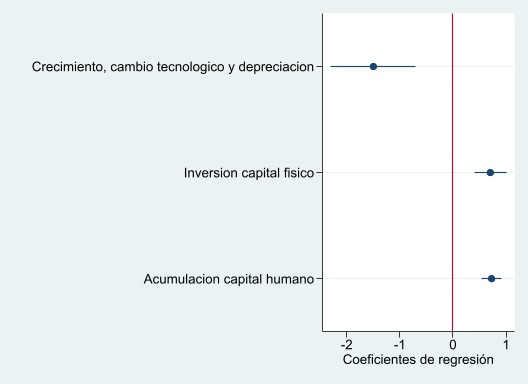

```{r setup, include=FALSE}
knitr::opts_chunk$set(warning = FALSE,
                      error = F, 
                      message = FALSE,
                      echo = FALSE, fig.pos = "H", out.extra = "") 
Sys.setlocale("LC_ALL","ES_ES.UTF-8") # para temas de caracteres en español, recomendable
summarytools::st_options(
  plain.ascii = FALSE, 
  style = "rmarkdown",
  dfSummary.style = "grid",
  dfSummary.valid.col = FALSE,
  dfSummary.graph.magnif = 1.5,
  subtitle.emphasis = FALSE,
  tmp.img.dir = "/tmp",
  lang = "es"
)
```

```{r load pack, echo = F}
# 1. Cargar paquetes ------------------------------------------------------
pacman::p_load(googledrive, easystats, tidyverse, ggthemes,
               sjPlot, sjmisc, summarytools,
               texreg, ggpubr, multcomp, jtools)
theme_set(theme_stata(base_size = 10, base_family = "sans", scheme = "s2color"))
sjPlot::set_theme(theme_stata(base_size = 10, base_family = "sans", scheme = "s2color"))
options(knitr.table.format = "latex")
kable <- function(data) {
  kableExtra::kable(data, booktabs = TRUE, digits = 3) %>% 
    kableExtra::kable_styling(latex_options =c("scale_down"), position = "center")
}

options(knitr.kable.NA = '')
table.expand <- function(cells, cols.width, justify, sep.cols) {
        cells <- enc2native(cells)
        .Call('pander_tableExpand_cpp', PACKAGE = 'pander', cells, cols.width, justify, sep.cols, style)
        .Call('pander_tableExpand_cpp', PACKAGE = 'pander', cells, cols.width, justify, sep.cols, style)
}

```

\thispagestyle{empty} 


\newpage


[Mankiw, Romer & Weil (1992)](https://academic.oup.com/qje/article-abstract/107/2/407/1838296)
testearon la consistencia del modelo de crecimiento de Solow con datos a nivel país desde 1960 a 1985. Como mostraremos a lo largo de la tarea, para ello los autores estimaron una serie de modelos de regresión lineal a partir del método de Mínimos Cuadrados Ordinarios (*OLS*) de modo de probar si el modelo de Solow es capaz de predecir cómo la inversión y el crecimiento de la población determinan los **estándares de vida** (ingreso real). En resumidas palabras su trabajo se resume en las siguientes hipótesis

*Objetivo 1:*  Determinar si el modelo teórico de Solow es consistente empíricamente a nivel mundial. Específicamente, si en el estado estacionario los determinantes del ingreso real de un país muestran ser significativos, seguir la dirección esperada y explicar parte importante de la varianza.

  $H_1$: Mientras que la inversión tiene un efecto positivo y significativo sobre el crecimiento económico, el crecimiento poblacional evidencia uno negativo.

*Objetivo 2*: Estimar especificaciones adicionales respecto a la inversión en capital, que permiten parcializar el efecto del capital físico y humano, corroborar si estas mejoran el ajuste del modelo y lo hacen más estable a la relación capital y producto

  $H_3$: El capital humano tiene un efecto parcial positivo y significativo sobre el crecimiento económico


*Objetivo 3*: Estimar formas funcionales de los determinantes del estándar de vida, de modo de entender mejor la varianza del ingreso real entre los distintos países. 

  $H_3$: Existe una convergencia hacia estándares de vida dado que los países más pobres tienden a crecer económicamente más rápido que aquellos ricos.


En punto inicial surge de evaluar el modelo de [*Solow (1956)*](https://academic.oup.com/qje/article-abstract/70/1/65/1903777) quien parte de una función de producción Cobb-Douglas, donde las variables principales son el **capital** ($K$) y **trabajo** ($L$), y a las que suma un *nivel de tecnología* ($A$) que se define en función de la *tasa de ahorro*[^g] $g$, *crecimiento poblacional* $n$ y *progreso tecnológico* $\delta$. 


$$Y(t) = K (t)^\alpha (A(t) L (t))^{1-\alpha}$$
donde el stock de capital se define como $k = K/AL$, y que en el estado estacionario se evidencia una relación positiva con el ahorro (*s*) y negativa con el crecimiento poblacional(*n*). 

$$
k^* = [\frac{s}{n+g+\delta}]^{\frac{1}{1-\alpha}}
$$

$$
ln (\frac{Y(t)}{L(t)}) = ln A(0) + gt + \frac{\alpha}{1-\alpha}\cdot ln(s_h) - \frac{\alpha}{1-\alpha} \cdot ln(n+g+ \delta)
$$

El primer modelo que [Mankiw, Romer & Weil (1992)](https://academic.oup.com/qje/article-abstract/107/2/407/1838296) estiman es el modelo simple de *crecimiento económico de [*Solow (1956)*](https://academic.oup.com/qje/article-abstract/70/1/65/1903777)*, que considera como verdadero que la elasticidad del ingreso respecto al ahorro ($s$) es *0.5* y *-0.5* al crecimiento poblacional  ($n + g + \delta$).

$$
ln (\frac{Y}{L}) = \alpha + \frac{\alpha}{1-\alpha}\cdot ln(s_h) + \frac{\alpha}{1-\alpha} \cdot ln(n+g+ \delta) + \epsilon
$$


[^g]: para Mankiw *et. al* (1992) representa los avances del conocimiento o tasa de cambio tecnológico

El segundo modelo es 


El tercer modelo es


# Descriptivos

- Aquí dejaré algunos descriptivos por cada submuestra

```{r desc, eval = F}
summarytools::dfSummary((data %>% dplyr::filter(.,n == 1) %>% dplyr::select(.,starts_with("ln"))), 
                                                                                  varnumbers = F, valid.col =  F, na.col = F, freqs.pct.valid = F, headings = F,
                                                                                  graph.magnif = 1.5, style = "grid", 
                                                                                  silent = T,
                                                                                  plain.ascii = F)
```
+-------------+--------------------------------------+---------------------------+-------------------------+----------------------+
| Variable    | Etiqueta                             | Estadísticas / Valores    | Frec. (% sobre válidos) | Gráfico              |
+=============+======================================+===========================+=========================+======================+
| ln_yl85\    | log PIB per cápita (1985)           | Media (d-s) : 8 (1.1)\    | 95 valores distintos    |  |
| [numeric]   |                                      | min < mediana < max:\     |                         |                      |
|             |                                      | 6 < 8.1 < 9.9\            |                         |                      |
|             |                                      | RI (CV) : 1.8 (0.1)       |                         |                      |
+-------------+--------------------------------------+---------------------------+-------------------------+----------------------+
| ln_yl60\    | log PIB per cápita (1960)           | Media (d-s) : 7.6 (0.9)\  | 96 valores distintos    |  |
| [numeric]   |                                      | min < mediana < max:\     |                         |                      |
|             |                                      | 5.9 < 7.5 < 9.4\          |                         |                      |
|             |                                      | RI (CV) : 1.4 (0.1)       |                         |                      |
+-------------+--------------------------------------+---------------------------+-------------------------+----------------------+
| ln_sk\      | log capital físico                  | Media (d-s) : -1.8 (0.5)\ | 83 valores distintos    |  |
| [numeric]   |                                      | min < mediana < max:\     |                         |                      |
|             |                                      | -3.2 < -1.8 < -1\         |                         |                      |
|             |                                      | RI (CV) : 0.7 (-0.3)      |                         |                      |
+-------------+--------------------------------------+---------------------------+-------------------------+----------------------+
| ln_ngdelta\ | Crecimiento, cambio tecnologico y    | Media (d-s) : -2.6 (0.1)\ | 34 valores distintos    |  |
| [numeric]   | depreciacion                         | min < mediana < max:\     |                         |                      |
|             |                                      | -2.9 < -2.6 < -2.4\       |                         |                      |
|             |                                      | RI (CV) : 0.2 (0)         |                         |                      |
+-------------+--------------------------------------+---------------------------+-------------------------+----------------------+
| ln_sh\      | log Capital humano                   | Media (d-s) : -3.2 (0.9)\ | 64 valores distintos    |  |
| [numeric]   |                                      | min < mediana < max:\     |                         |                      |
|             |                                      | -5.5 < -3 < -2.1\         |                         |                      |
|             |                                      | RI (CV) : 1.2 (-0.3)      |                         |                      |
+-------------+--------------------------------------+---------------------------+-------------------------+----------------------+
| ln_yl85_60\ | log PIB por trabajador inicial-final | Media (d-s) : 0.4 (0.4)\  | 98 valores distintos    |  |
| [numeric]   |                                      | min < mediana < max:\     |                         |                      |
|             |                                      | -0.7 < 0.4 < 1.7\         |                         |                      |
|             |                                      | RI (CV) : 0.6 (1)         |                         |                      |
+-------------+--------------------------------------+---------------------------+-------------------------+----------------------+

# Pregunta 1

La hipótesis que se buscó probar por parte de Mankiw et. al (1992) es de si el modelo de crecimiento económico de *Solow* es consistente con la evidencia empírica ($H_1$). La importancia de ello surge de que durante esos años la macroeconomía puso en cuestión dicho modelo por el carácter exógeno de sus determinantes, y por ello, se propusieron construir modelos de regresión especificando el ahorro y crecimiento poblacional como *independientes* del error de estimación (y en eso la importancia de los modelos *OLS*).

Para efectos de la tarea tomaremos el último modelo considerando $\frac{\alpha}{1-\alpha} = \beta$, y supondremos que g + $\delta$= 0.05 (tal como hace Mankiw et al (1992))

$$
ln (\frac{Y}{L}) = \beta_o + \beta_1\cdot ln(s_h) + \beta_2 \cdot ln(n+g+ \delta) + u
$$

donde definiremos como

- $\frac{Y}{L}$:  el producto (PIB) per cápita para la población en edad de trabajar (1985)
- $s_k$: $\frac{I}{Y}$ tasa de inversión en capital físico
- $n$: tasa de crecimiento de la población en edad de trabajar (1985)
- $g$: tasa de cambio tecnológico
- $\delta$: tasa de depreciación

## 1.1 Estime la ecuación por MCO para cada submuestra de países.


**Tabla 1**. Modelos de regresión lineal que estiman log GDP por trabajador 1985
```{r tab1}
tab1 <- readxl::read_xls("../report2/output/tab/tabla1_1.xls", skip = 2)
tab1 %>%
  dplyr::select(Predictores = 1, "Non-oil" = 2 , "Intermediate" = 3 , "OECD" = 4) %>%
  slice(-c(1,2)) %>% 
  kableExtra::kable(., booktabs = T) %>% kableExtra::kable_styling(latex_options =c("HOLD_position","scale_down"), position = "center")
```

# 1.2 Interpretar

En términos generales, los resultados del modelo reportado en la *Tabla N°1* se condicen con las estimaciones realizadas por Makinw et. al (1992), tanto en términos de dirección, tamaño efecto como ajuste de los modelos. Ahora bien, los resultados no son idénticos al menos con 3 cifras significativas, por lo que no podemos plantear una replicación del artículo. Por ello, a continuación interpretaremos y contrastaremos cada uno de los resultados. 


### Inversión de capital físico

Primero, respecto al efecto parcial de la inversión de capital físico sobre el crecimiento económico, controlando por el crecimiento poblacional, podemos decir que con un 99% de confianza existe evidencia sustantiva que indica un *efecto positivo* de la tasa de inversión en capital físico sobre el crecimiento económico. De manera más precisa, en la submuestra de países que producen principalmente **petróleo** (*Non-oil*) si se genera un aumento en 1% de la tasa de inversión capital físico, la tasa de crecimiento anual del PIB real aumentaría en **1,423%** puntos porcentuales, controlando por el resto de las variables del modelo. Un resultado similar ocurre con los países con población intermedia donde el aumento en 1% de $s_k$, produce un aumento de  **1,318%** (*p < 0.001*). No podemos llegar a la misma conclusión en el caso de los países OECD, donde con un 95% de confianza no podemos rechazar la hipótesis nula que indica que el predictor no tiene un efecto sobre la tasa de crecimiento ($\beta = 0$).


Podemos notar que los coeficientes y significancia asociados a la inversión de capital físico se reproducen a los reportados por los autores para las tres muestras (1,42%, 1,31% y 0.5, respectivamente). De manera similar, tomando la elasticidad del ingreso respecto a la inversión del capital ($\beta_{1-non-oil}$) para el modelo *Non-oil*, podemos obtener un $\alpha_{r-non-oil} = 0,5872$ que es cercano al obtenido por Mankiw et. al (1992) ($\alpha_{o-non-oil} = 0,60$), esto es, la relación entre capital e ingresos. Podemos extender este hallazgo al modelo *Intermediate* y *OECD* ($\alpha_{r-int}=0,5671 \land \alpha_{o-int}= 0,59$ y $\alpha_{r-oecd}=\frac{1}{3} \land \alpha_{o-int}= 0,36$).

### Crecimiento poblacional, cambio tecnológico y depreciación

Segundo, en general nos referiremos a crecimiento poblacional en la medida en que se asume que la depreciación ($\delta$) y  tasa de cambio tecnológico ($g$) son constantes entre países[^constant], por lo que la diferencia en el crecimiento poblacional es lo que define la elasticidad reportada. A este respecto podemos decir que con un 99% de confianza existe evidencia sustantiva que indica un *efecto negativo* del crecimiento de la población sobre el crecimiento económico, tal como [*Solow (1956)*](https://academic.oup.com/qje/article-abstract/70/1/65/1903777) había propuesto. 

Podemos notar que en la submuestra de países *"Non-oil"* un aumento en 1% de $n + g + \delta$, la tasa de crecimiento anual del PIB real disminuye en **1,990%** puntos porcentuales, controlando por la tasa de inversión en capital físico. Del mismo modo, en los países *"Intermediate"* un aumento en 1% del predictor, produce una disminución de **-2,017%** del crecimiento económico( también con un 99% de confianza). Al igual que en análisis de la inversión en capital físico, los modelos estimados con la submuestra *OECD* no muestran ser significativos a un 95% de confianza, por lo que en ese caso no podemos rechazar la hipótesis nula que indica que el predictor no tiene un efecto sobre la tasa de crecimiento económico ($\beta = 0$).


Respecto a la replicación de estimaciones, los coeficientes y significancia asociados al crecimiento poblacional son *similares* a los reportados por los autores para las tres muestras (-1.97%, -2.01% y -0.76, respectivamente). También volvemos a analizar el valor estimado de $\alpha$, pero ahora asociada a la *elasticidad del ingreso respecto al crecimiento poblacional, cambio tecnológico y depreciación*. Notemos que si bien se propone un único valor de $\alpha$ en el modelo (pero contrario en signos), aún no hemos probado realmente si esta hipótesis es cierta (lo que veremos en el siguiente punto).  Por consiguiente obtenemos similares $\alpha$, pero más alejados que para la elasticidad anterior: Para *"Non-oil"* $\alpha_{r-non-oil}= 0,66 \land \alpha_{o-non-oil}= 0,59$; *"Intermediate"* $\alpha_{r-int}= 0,66 \land \alpha_{o-int}= 0,59$ y *"OECD"* $\alpha_{r-oecd}= 0,43 \land \alpha_{o-int}= 0,36$.

[^constant]: el primero pues no hay datos y el segundo por intuición económica de los autores 


Nota personal: si queda tiempo poner en anexos calculos de significancia del modelo de la tabla 1

### Bondad de ajuste


Tal como indica *Mankiw et. al (1992)*, el modelo explica parte importante de la variación entre los países respecto al crecimiento económico (o ingreso real). De manera más precisa, en los países con producción industrial principalmente petrolera, la inversión y el crecimiento de la población explica en un 59,2% la varianza del PIB per cápita ($\bar{R}^2_{r-non-oil} = 0,592 \land \bar{R}^2_{o-non-oil} = 0,59$). La bondad de ajuste del modelo para los países intermedios también reporta ser importante: cerca de un 58,8% de la variación del producto por trabajador es explicada por la varianza en nuestros predictores ($\bar{R}^2_{r-int} = 0,588 \land \bar{R}^2_{o-int} = 0,59$). Este buen escenario dista de ser igual para los países *OECD* en tanto el ajuste solo alcanza un 1,2% ($\bar{R}^2_{r-oecd} = 0,012 \land \bar{R}^2_{o-oecd} = 0,01$).

Como se puede notar, los *R cuadrado ajustado* por nuestro equipo y Mankiw et. al (1992) son muy similares ($\bar{R}^2_{r} \approx  \bar{R}^2_{o}$).


# 1.3 Contraste hipótesis (combinación lineal)

Recordemos que cuando revisamos el modelo propuesto por Solow, notamos que se planteaba que las elasticidades respecto al ingreso real eran iguales en magnitud pero de distinto signo (tal como se puede evidenciar *claramente* en la tercera ecuación reportada). Por ello, probaremos la siguiente hipótesis para cada una de las submuestras[^h1]

$$H_0 : \beta_1 + \beta_2 = 0 \\
H_1 : \beta_1 + \beta_2 \neq 0$$


El estadístico que nos permitió hacer ese contraste es el *estadístico F*. En la **Tabla 1.2** podemos ver un resumen de nuestros resultados. Para las tres submuestras podemos afirmar que con un 95% de confianza no se puede rechazar la hipótesis nula. Esto quiere decir de que no hay evidencia suficiente para afirmar lo propuesto por *Solow*, esto es, que el efecto parcial de la inversión y el crecimiento poblacional es igual en magnitud pero distinto en signo.

**Tabla 1.2** Test restricciones múltiples para elasticidades del crecimiento económico

|  | **Non-oil** | **Intermediate** | **OECD** |
|---|---|---|---|
| F(q, n-k-1) | F(1, 95) = 0,83 | F(1,72) = 1,29 | F(1,19)=0,06 |
| p-value | 0,3634 | 0,2592 | 0,8086 |

Pese a que los autores del artículo no muestran la evidencia, llegan a la misma conclusión que hemos indicado. De hecho, no solo los coeficientes son estadísticamente distintos (con un 5% de error), sino que también la magnitud obtenida es mayor a la propuesta teóricamente. De manera más precisa, el modelo teórico de *Solow* propone un $\alpha = \frac{1}{3}$, mientras que los modelos que hemos calculado tienen en promedio un $\alpha = 0,59$. Dicho eso, el modelo empírico sobre-estima el impacto de la inversión y el crecimiento de la fuerza de trabajo. Comentaremos ese punto en lo que viene

[^h1]: Lo que es equivalente a lo teateado por Mankiw et al. (1992) $H_0 : \frac{\alpha_1}{1-\alpha_1} + \frac{\alpha_2}{1-\alpha_2} = 0$


### Síntesis sobre hallazgos


Iniciamos este análisis mencionando que la hipótesis que se buscó probar por parte de Mankiw et. al (1992) es de si el modelo de crecimiento económico de *Solow* es consistente con la evidencia empírica ($H_1$).

En términos empíricos, nos sumamos a los hallazgos encontrados por Mankiw et. al (1992) respecto al modelo teórico de Solow. Esto quiere decir que en términos generales hemos obtenido las mismas estimaciones que los investigadores. Con eso cumplimos con dar más evidencia a la primera hipótesis del artículo ($H_1$).

En términos sustantivos, tanto los autores del artículo como nosotros nos enfocamos en revisar dos resultados y un supuesto del modelo teórico de *Solow*

**1. Coeficientes($\hat{\beta}$):** la dirección y significancia de las relaciones estimadas son las planteadas teóricamente. Esto quiere decir que se predice que países con una mayor inversión en capital físico tienen un mayor ingreso real; así como países con mayor crecimiento poblacional tienen menores ingresos reales.

En términos económicos ambas variables tienen sentido, en la medida en que una mayor inversión en capital produce más medios para aumentar la producción, lo que tiene como correlato un aumento en los estándares de vida (*ceteris paribus*). Mientras que un aumento en la población disponible para trabajar disminuye el estándar de vida en términos agregados, toda vez que esto puede implicar un aumento de la población de reserva (ya sea en personas desempleadas o inactivas laboralmente). 

**3. Tamaño de efecto de coeficientes(test de combinación):**  no solo son distintos, sino que su tamaño efecto es diferente al propuesto. De hecho, si se parte estimando los modelos con el valor propuesto por *Solow* (método growth accountain), la bondad de ajuste promedio de las submuestras cae significativamente de 0,59 a 0,28 ($\bar{R^2}$)

Siguiendo con la interpretación anterior, es esperable que el efecto parcial de este "contaminado" con el efecto parcial de otros predictores. De manera exploratoria pensamos que esto podría implicar una interacción de estos, o que existan otros factores como el capital humano que especifiquen mejor el modelo.

**2. Bondad de ajuste($\bar{R^2}$):** el modelo explica parte importante de la varianza de la variable dependiente (sobre un 50% en el caso de la submuestra "Non-oil" e "Intermediate")

Pese a que las elasticidades tienen sentido económico, son significativas y la bondad de ajuste también es alta *aun no se puede decir que el modelo es exitoso* considerando que si estimamos el modelo con las soluciones estacionarias de las elasticidades, el ajuste del modelo cae significativamente. Esto proviene de dos problemas que trataremos de discutir en la pregunta N°2 y N°3. La primera tiene que ver con el sesgo de variable omitida y la segunda con el problema de heterocedasticidad, dos problemas frecuentes en modelos macroeconómicos a nivel país[^ocde]

[^ocde]: De hecho, no es casual que los resultados para los modelos *OECD* no den significativos y divergan tanto de los otros modelos. Esto se debe a que principalmente existe poca varianza tanto en la variable dependiente como en los predictores del modelo, junto con que el tamaño de las observaciones es muy pequeño (problemas de identificación). El otro caso que se da en estudios como estos es cuando la medición de los predictores está asociada al error pues muchas veces tener valores de estos países está asociado a niveles de desarrollo, robustez institucional, etc. También ocurre cuando países más ricos tenderán a tener más ahorros, mientras que países más pobres mayores niveles de crecimiento poblacional (la varianza del error no será constante, y probablemente dependa de los parámetros desde los cuales estamos estimando los modelos).


\newpage

# Pregunta 2

En la segunda parte del análisis, MRW estiman un modelo de Solow que incluye capital
humano. La ecuación de referencia es:

$$
ln (\frac{Y}{L}) = \beta_o + \beta_1\cdot ln(n+g+ \delta) + \beta_2 \cdot ln(s_k) + \beta_3 \cdot ln(s_h)  + u
$$

donde

- $\frac{Y}{L}$:  el producto por trabajador
- $s_k$: $\frac{I}{Y}$ tasa de inversión en capital físico
- $s_h$: tasa acumulación en capital humano (medido en escolaridad)
- $n$: tasa de crecimiento de la población en edad de trabajar
- $g$: tasa de cambio tecnológico
- $\delta$: tasa de depreciación.

**Tabla 2**. Modelos de regresión lineal que estiman log GDP por trabajador 1985
```{r tab2}
tab2 <- readxl::read_xls("../report2/output/tab/tabla1_2.xls", skip = 2)
tab2 %>%
  dplyr::select(Predictores = 1, "Non-oil" = 2 , "Intermediate" = 3 , "OECD" = 4) %>%
  slice(-c(1,2)) %>% 
  kableExtra::kable(., booktabs = T) %>% kableExtra::kable_styling(latex_options =c("HOLD_position","scale_down"), position = "center")
```

# 2.2 Interpretación

Interprete el coeficiente estimado de la variable ln(school). ¿Es el coeficiente
estadísticamente significativo al 5%?

# 2.3 Hipótesis (combinación lineal)

Contraste la hipótesis de que la suma de los tres coeficientes es cero (como predice
el modelo) para cada una de las submuestras ($H_0 : \beta_1 + \beta_2 + \beta_3 = 0$). ¿Puede rechazar la hipótesis nula al 5%?

**Tabla 2.3** Test restricciones múltiples para elasticidades del crecimiento económico

|  | **Non-oil** | **Intermediate** | **OECD** |
|---|---|---|---|
| F(q, n-k-1) |  F(1 , 94) = 0,74 | F(1 , 71) =0.02 | F(1  ,18) = 0.00 |
| p-value | 0,3904| 0,8828 | 0,9711 |


\newpage

# Pregunta 3

MRW también utilizan análisis de regresión para estudiar la idea de convergencia en el
marco del modelo de Solow.


## 3.1 Estimación

El primer paso es analizar la convergencia incondicional. Este tipo de convergencia
implica que la tasa de crecimiento del producto por trabajador debe estar
negativamente correlacionada con el nivel de producto por trabajador inicial. Estime
la ecuación de convergencia incondicional para cada submuestra usando 1960 como
año de referencia inicial:

$$
ln (\frac{Y_1985}{L_1985}) - ln (\frac{Y_1960}{L_1960}) = \beta_o + \beta_1\cdot ln (\frac{Y_1960}{L_1960})  + u
$$


### 3.1.1 Tabla

**Tabla 3**. Modelos de regresión lineal que estiman convergencia incondicional
```{r tab3}
tab3 <- readxl::read_xls("../report2/output/tab/tabla1_3_1.xls", skip = 2)
tab3 %>%
  dplyr::select(Predictores = 1, "Non-oil" = 2 , "Intermediate" = 3 , "OECD" = 4) %>%
  slice(-c(1,2)) %>% 
  kableExtra::kable(., booktabs = T) %>% kableExtra::kable_styling(latex_options =c("HOLD_position","scale_down"), position = "center")
```

### 3.1.2 Graficar

Grafique también la relación entre la tasa de crecimiento y el log del producto por
trabajador en 1960. Interprete los resultados. ¿Hay evidencia de convergencia
incondicional?

*Ver anexos con otras figuras*

```{r conv-in-n, results='asis', fig.cap="Coeficiente de modelos de convergencia incondicional - Non Oil"}
knitr::include_graphics("../report2/output/figure-plot-modelo3_n.jpg")
```

```{r conv-in-i, results='asis', fig.cap="Coeficiente de modelos de convergencia incondicional - Intermediate"}

```

```{r conv-in-o, results='asis', fig.cap="Coeficiente de modelos de convergencia incondicional (con errores estándar robustos) - OECD"}
knitr::include_graphics("../report2/output/figure-plot-modelo3_o.jpg")
```

## 3.2 Estimación Modelo condicional

Ahora analicemos la convergencia condicional. Para eso agregamos a la ecuación
anterior $ln(n + g + \delta)$, $ln(s_k)$ y $ln(s_h)$ como variables explicativas.
Estime la ecuación de convergencia condicional para cada submuestra de países. Interprete los resultados y discuta si hay evidencia de convergencia condicional.

$$
ln (\frac{Y_1985}{L_1985}) - ln (\frac{Y_1960}{L_1960}) = \beta_o + \beta_1\cdot ln (\frac{Y_1960}{L_1960})  + \beta_2 \cdot ln(n + g + \delta)+ \beta_3 \cdot ln(s_k) + \beta_4 \cdot ln(s_h) +  u
$$
**Tabla 3.2**. Modelos de regresión lineal que estiman convergencia condicional
```{r tab3_2}
tab3_2 <- readxl::read_xls("../report2/output/tab/tabla1_3_2.xls", skip = 2)
tab3_2 %>%
  dplyr::select(Predictores = 1, "Non-oil" = 2 , "Intermediate" = 3 , "OECD" = 4) %>%
  slice(-c(1,2)) %>% 
  kableExtra::kable(., booktabs = T) %>% kableExtra::kable_styling(latex_options =c("HOLD_position","scale_down"), position = "center")
```

(Comparar con Tabla V de Mankiw)

## 3.3 Modelo condicional con interacción

Se cree que el efecto de la tasa de inversión en capital físico podría ser
complementario al de la tasa de acumulación en capital humano. Cree la interacción
entre $ln(s_k)$ y $ln(s_h)$ en Stata y agréguela como variable explicativa adicional en la ecuación de convergencia condicional de la pregunta anterior.

- ¿Encuentra evidencia a favor de la complementariedad que se sugiere (es el coeficiente de la interacción positivo y estadísticamente significativo)?

- Discutir para cada submuestra de países.

$$
ln (\frac{Y_1985}{L_1985}) - ln (\frac{Y_1960}{L_1960}) = \beta_o + \beta_1\cdot ln (\frac{Y_1960}{L_1960})  + \beta_2 \cdot ln(n + g + \delta)+ \beta_3 \cdot ln(s_k) + \beta_4 \cdot ln(s_h) + \beta_5 \cdot ln(s_k) \cdot ln(s_h)+  u
$$
**Tabla 3.3**. Modelos de regresión lineal que estiman convergencia condicional con complementariedad de capital físico y humano
```{r tab3_3}
tab3_3 <- readxl::read_xls("../report2/output/tab/tabla1_3_3.xls", skip = 2)
tab3_3 %>%
  dplyr::select(Predictores = 1, "Non-oil" = 2 , "Intermediate" = 3 , "OECD" = 4) %>%
  slice(-c(1,2)) %>% 
  kableExtra::kable(., booktabs = T) %>% kableExtra::kable_styling(latex_options =c("HOLD_position","scale_down"), position = "center")
```


## 3.4 Inferencia Robusta

### 3.4.1 Test de White

Implemente el test de heteroscedasticidad de White y discuta los resultados para cada
submuestra de países.

**Tabla 3.4** Test de White

|  | **Non-oil** | **Intermediate** | **OECD** |
|---|---|---|---|
| Chi ($X^2$) |  24,41 | 23,83 |  21,27 |
| p-value | 0,1810|  0,2028 | 0,3223 |


### 3.4.2 Estimación por errores estándar

¿Se mantienen los resultados encontrados en III usando errores estándar robustos a heteroscedasticidad?

**Tabla 3.4**. Modelos de regresión lineal que estiman convergencia condicional con complementariedad de capital físico y humano
```{r tab3_r}
tab3_3r <- readxl::read_xls("../report2/output/tab/tabla1_3_3robust.xls", skip = 2)
tab3_3r %>%
  dplyr::select(Predictores = 1, "Non-oil" = 2 , "Intermediate" = 3 , "OECD" = 4) %>%
  slice(-c(1,2)) %>% 
  kableExtra::kable(., booktabs = T) %>% kableExtra::kable_styling(latex_options =c("HOLD_position","scale_down"), position = "center")
```

Discutir si se mantienen resultados

## 3.5 Graficar

Grafique los residuos de la regresión anterior (con errores estándar robustos) como función de la interacción entre la tasa de inversión en capital físico y la tasa de acumulación en capital humano. Interprete las figuras para cada submuestra.

```{r nonoil, results='asis', fig.cap="Residuos modelos de convergencia condicional (con errores estándar robustos) - Non Oil"}

```

```{r inter, results='asis', fig.cap="Residuos modelos de convergencia condicional (con errores estándar robustos) - Intermediate"}
knitr::include_graphics("../report2/output/figure-plot-modelo3_3robust_residual_i.jpg")
```

```{r oecd, results='asis', fig.cap="Residuos modelos de convergencia condicional (con errores estándar robustos) - OECD"}
knitr::include_graphics("../report2/output/figure-plot-modelo3_3robust_residual_o.jpg")
```

\newpage

# Referencias

Solow, R. M. (1956). A contribution to the theory of economic growth. The quarterly journal of economics, 70(1), 65-94.

\newpage

# Apéndice


## Código en STATA{#stata}

## Figuras adicionales

#### **Modelo 1- Coeficientes**
```{r coef1-n, results='asis', fig.cap="Modelo de regresión 1 - Non Oil"}

```
```{r coef1-i, results='asis', fig.cap="Modelo de regresión 1 - Intermediate"}

```
```{r coef1-o, results='asis', fig.cap="Modelo de regresión 1 - OECD"}

```


#### **Modelo 1 - efecto parcial del capital físico**
```{r coef1-n-ln, results='asis', fig.cap="Modelo de regresión 1 - Non Oil"}

```
```{r coef1-i-ln, results='asis', fig.cap="Modelo de regresión 1 - Intermediate"}

```
```{r coef1-o-ln, results='asis', fig.cap="Modelo de regresión 1 - OECD"}
knitr::include_graphics("../report2/output/figureln_sk-anexos-modelo1o.jpg")
```


#### **Modelo 2 - Coeficientes**
```{r coefmodelo2-o, results='asis', fig.cap="Modelo de regresión 2 - Non Oil"}

```
```{r coef2-i, results='asis', fig.cap="Modelo de regresión 2 - Intermediate"}

```
```{r coef2-o, results='asis', fig.cap="Modelo de regresión 1 - OECD"}
knitr::include_graphics("../report2/output/figure-plot-modelo2_o.jpg")
```

#### **Modelo 2 - Efecto parcial capital humano**
```{r coefmodelo2-o-h, results='asis', fig.cap="Modelo de regresión 2 - Non Oil"}
knitr::include_graphics("../report2/output/figure-anexos-modelo2n.jpg")
```
```{r coef2-i-h, results='asis', fig.cap="Modelo de regresión 2 - Intermediate"}

```
```{r coef2-o-h, results='asis', fig.cap="Modelo de regresión 1 - OECD"}
knitr::include_graphics("../report2/output/figure-anexos-modelo2o.jpg")
```


## Notación

### Subíndices{#subindices}

- $t$: Estadístico o modelo teórico, construido por [*Solow (1956)*](https://academic.oup.com/qje/article-abstract/70/1/65/1903777)
- $o$: Estadístico o modelo original, obtenido por Mankiw et al (1992)
- $r$: Estadístico o modelo replicado por el equipo de la Tarea N°2

- $non-oil$: países donde la producción de petróleo es dominante en el sector industrial, excluyendo a los productores de petróleo pues no es considerado como un input al PIB.
- $int$: países donde su población es mayor a un millón (en 1960), consideración que toman los autores pues si no el ingreso real puede estar determinando más bien por factores idiosincráticos.
- $oecd$: países pertenecientes a la *Organización Cooperación y Desarrollo Económico* (OECD, en inglés)
