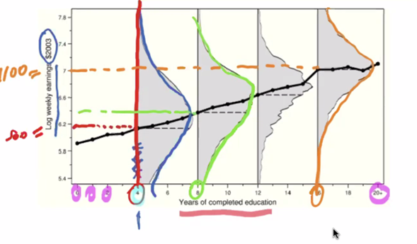
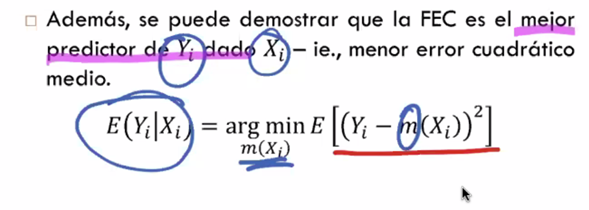

# Econometría I

Profesor: Juan Urquiza

## Clase 1

¿Qué es la econometría? Una disciplina que emplea la teoría económica y los métodos estadísticos para estudiar relaciones  económicas, contrastar distintas teorías, pronosticar variables, y evaluar políticas en forma cuantitativa, utilizando bases de datos.

1. Estudia relaciones económicas
2. Contrastar distintas teorías
3. Pronosticar variables
4. Evaluar políticas en forma cuantitativa

Combinar estadística para dar respuesta a la teoría económica. Es una aplicación del método científico a la economía. La observación dara paso a la formulación de hipótesis y pruebas empíricas.

En el curso vamos a buscar

1. Estimar cómo la esperanza condicional de una variable depende de otra
  - Modelos de regresión y con parcialización.
  - Modelos de crecimiento sugieren convergencia de PIB
2. Estimar el efecto causal de una variable sobre otras
  - Análisis de causalidad
  - Desafíos de los análisis,dado que no podemos controlar todos los factores realmente.
3.  Predicción sobre el comportamiento de variables
  - Banco Central en tasa de inflación
  - Series de tiempo

**Datos**

- Datos experimentales
- Datos observacionales

Q: ¿Preguntas causales con datos observacionales?

**Datos**

1.  Datos de sección cruzada o corte transversal

- Mediciones de distintas entidades en un momento de tiempo
- Unidades de observaciones: personas, hogares, firmas, industrias
- Ejemplo: CASEN

2. Datos de series de tiempo
- Secuencia de observaciones en un intervalo de tiempo determinado
- Ejemplo: la distribución de un país de inflación, desempleo y crecimiento económico.

3. Combinados transversales
- No hay seguimiento de las mismas unidades. Pero se pegan los data frames
- Combinación de datos transversal

4. Datos panel
- Seguimiento de las mismas unidades en el tiempo.
- Q: Datas mundiales, ENE o EPS ¿empalmes?

## Clase 2

**Función de esperanza condicional**

La esperanza condicional nos permitirá relacionar las variables. Dado que $X_i$ es una variable aleatoria, entonces la FEC también lo es.

Por ejemplo, la relación entre salario y años de ecuación. Hay diferencias en los salarios según los años de educación, y para cada grupo si bien hay una distribución podemos hablar de la media.

**Ley de esperanzas iteradas**

Nos permitirá descomponer el $Y_i$ en un término que es $E (Y_i | X_i) + e_i$, junto a su vez que $E (e_i | X_i) = 0$.

Esto nos garantiza que existe una representación que está descompuesto como una variable aleatoria Y que es condicional a X, más algo que no está relacionado a Xi

En síntesis, permite descomponer variables aleatorias. Si uno quiere relacionar dos variables **FEC**.

**Función de Regresión Poblacional**

Si queremos llegar a la FEC es partir por FRP.

- La FRP es el mejor predictor lineal de $Y_i$
- Va a ser la mejor predicción lineal.

**Modelo de Regresión Lineal Simple**

- El termino error o perturbación inobservable. Refiere a factores (o variable no observada, incluida), y esto produce la distancia entre los valores esperados en la FEC y FRP.
- Esto permite hacer análisis ceteris paribus de cada predictor.

- Como se soluciona la endogeneidad.
- Niveles de confirmación y exploración.

- Especificación: lo fundamental es la relación lineal. La relación lineal se ve como una **combinación lineal** entre variables.

- Ceteris paribus: también se calcula con la variación de la esperanza.

- Causalidad: no hay una relación de causalidad (¿mirar formulas 2.19 en JW?). ¿Diferencia corr por lo de parcialización, varianza/variabilidad?

- Control estadístico: relevante pues si no se hacen estimaciones sesgadas.

## Clase 3

 Utilizamos MCO para reducir los residuos, entonces minimizamos la suma cuadrada de los residuos.

## Clase 4

### Propiedades alegbraicas de MCO

Las propiedades agebraicas se derivan de las llamadas ecuaciones normales para MCO.

1. La suma de residuos da cero pues el MCO está optimizado para ello.

**R cuadrado**
Corresponde a la proporcion de la variación muestral de y que es explicada por la regresión de MCO.

Implicitamente con MCO **maximizamos** R cudradado, al intentar minimizar *SCT* en relación a los *SCE*. Entre más parecidos sea SCE y SCT, mayor va a ser el ajuste o el R cuadrado.
